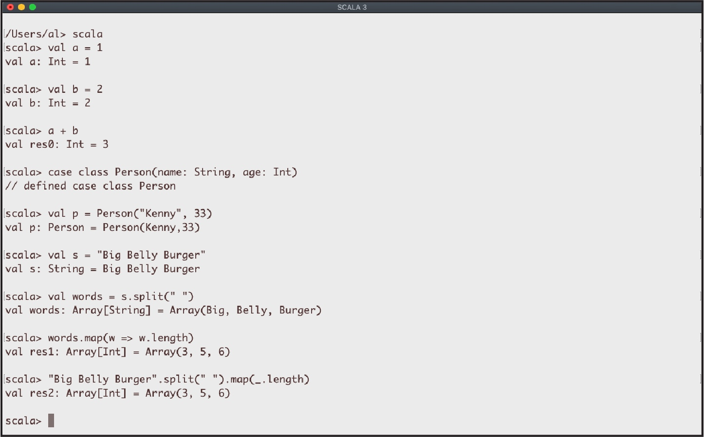

# 命令行任务

我们的Scala 3之旅，始于命令行。比如，在你按照xxi页“安装Scala”后，你可能会想要从操作系统的命令行中输入 **scala** 来启动REPL——Scala的 Read/Eval/Print/Loop （添加备注：REPL基本上是现在所有主流语言的标配 java也有javashell了）。或者你可能想要创建一个小小的基于文件的“Hello, world“项目，然后来编译运行它。因为许多人开始使用Scala是从命令行任务开始的，所以我们先从这里开始介绍。

REPL是一个命令行 *shell*，它是一个小实验室，你可以在这里运行各种小测试来看看Scala和它的一些第三方库是如何工作的。如果你熟悉Java的JShell，Ruby的 **irb**，Python的shell或者IPython，或者Haskell的 **ghci**，那么Scala的REPL与这些都很相似。如图1-1所示，只要在操作系统命令行输入 **scala** 就可以启动REPL，然后再输入Scala表达式然后就会在 shell 中被求值。

当你想测试一些Scala代码时，REPL是一个绝佳的实验环境。没必要创建一个完整的工程——只需要将你的测试代码放到REPL中进行实验，直到你知道它能工作了为止。由于REPL是一个非常重要的工具，它最重要的功能将在本章的前两个例子中演示。



图1-1. macOS 终端窗口中运行Scala3 REPL

虽然REPL非常棒，但它不是你唯一的选项。*Ammonite REPL* 最初是为Scala 2创建的，它比Scala2 REPL有更多的功能，包括：

- 能从GitHub和Maven仓库中导入代码
- 保存和恢复会话的能力
- 美化打印输出
- 多行编辑

在写这本书的时候， Ammonite仍在为Scala 3做迁移， 但许多重要的功能已经可以使用了。关于如何使用这些功能的例子，见例子1.3。

最后，当你需要构建Scala项目时，你通常会使用像sbt这样的构建工具，这将在第17章中演示。但如果你想编译和运行一个小型的Scala应用，比如只有一两个文件，你可以用 **scalac** 命令编译你的代码，然后使用 **scala** 运行就像在Java中使用 **javac** 和 **java** 命令那样。这些过程将在例子1.4中进行演示。之后，例子1.6展示了如何使用 **java** 或 **scala** 命令运行你打包成JAR文件的应用程序。

## 1.1 Scala REPL 入门

### 问题

开始使用Scala REPL，使用它的一些基本功能

### 解决方法

如果你使用过Java，Python，Ruby和Haskell等语言的REPL环境，你会觉得Scala REPL很熟悉。要启动REPL，在你的操作系统的命令行中输入 **scala**。当REPL启动时，你可能看到一个初始信息，紧接着的是 **scala** >提示符：
```
    $ scala
    Welcome to Scala 3.0
    Type in expressions for evaluation. Or try :help.
    
    scala> _
```

该提示表明你正在使用Scala REPL。在REPL环境中，你可以尝试各种不同的实验和表达式。
```
    scala> val x = 1
    x: Int = 1
    
    scala> val y = 2
    y: Int = 2
    
    scala> x + y
    res0: Int = 3
    
    scala> val x = List(1, 2, 3)
    x: List[Int] = List(1, 2, 3)
    
    scala> x.sum
    res1: Int = 6
```

正如上述例子所示：

- 输入命令后，REPL输出显示你的表达式的结果，包括数据类型信息。
- 如果没有指定一个变量名，如第三个例子所示，REPL会创建自己的变量，以**res0**开头然后是**res1**以此类推。你可以直接使用这些变量名，就像这些变量是你创建的那样：
```
    scala> res1.getClass
    res2: Class[Int] = int
    
    scala> res1 + 2
    res3: Int = 8
```

初学者和有经验的开发者每天都会在REPL中编写代码，以快速了解Scala的功能和他们自己的算法是如何工作的。

#### Tab 补全

有一些简单的技巧可以使REPL的使用更加有效。一个技巧是使用*tab 补全*来查看一个对象上的可用方法。我们可以通过输入1然后一个小数点再然后按Tab键来看看tab 补全是如何工作的。REPL的响应是列出**Int**实例上的几十个可用方法：
```
    scala> 1.
    !=           finalize               round
    ##           floatValue             self
    %            floor                  shortValue
    &            formatted              sign
    *            getClass               signum
    many more here ...
```

你也可以通过输入方法名的第一部分，然后按Tab键来限制所显示的方法列表。比如，如果你想看**List**上所有的方法，输入**List(1)**。然后按Tab键，你会看到超过200个方法。但如果你只关心**List**上以**to**开头的方法，那么你可以输入**List(1).to** 然后按Tab键，输出结果就会减少到这些方法：
```
    scala> List(1).to
    to              toIndexedSeq        toList      toSet           toTraversable
    toArray         toIterable          toMap       toStream        toVector
    toBuffer        toIterator          toSeq       toString
```

#### 讨论

我使用REPL创建了许多小实验，这有助于我理解Scala自动执行的一些类型转换。比如，当我刚开始使用Scala时，我在REPL中输入以下代码时，我不知道变量 **x** 的类型是什么：
```
    scala> val x = (3, "Three", 3.0)
    val x: (Int, String, Double) = (3,Three,3.0)
```

在REPL中很容易运行这样的测试，然后在一个变量上调用**getClass**来查看其类型：
```
    scala> x.getClass
    val res0: Class[? <: (Int, String, Double)] = class scala.Tuple3
```

虽然对于刚开始使用Scala的你来说，上面这一行输出的可读性有些差，但是=右边的信息能让你知道这个类型是一个 **Tuple3**

你也可以使用REPL的 **:type** 命令来查看类似的信息，尽管并不会显示 **Tuple3** 的名字：

&nbsp;&nbsp;&nbsp;&nbsp;scala> **:type x**

&nbsp;&nbsp;&nbsp;&nbsp;(Int, String, Double)

然而，一般来说，在许多其他情况下，这个命令还是有帮助的：

&nbsp;&nbsp;&nbsp;&nbsp;scala> **:type 1 + 1.1**

&nbsp;&nbsp;&nbsp;&nbsp;Double

&nbsp;&nbsp;&nbsp;&nbsp;scala> **:type List(1,2,3).map(_ * 2.5)**

&nbsp;&nbsp;&nbsp;&nbsp;List[Double]

虽然这些都是简单的例子，但你会发现，当处理更复杂的代码以及那些你不熟悉的库时，REPL是非常有帮助的。


##### 在sbt内部启动REPL

你也可以从sbt shell中启动Scala REPL会话，如例17.5“了解其他sbt命令”所示，只要在一个sbt项目中启动sbt shell：

&nbsp;&nbsp;&nbsp;&nbsp;$ **sbt**

&nbsp;&nbsp;&nbsp;&nbsp;MyProject> _

然后在那使用 **console** 或者 **consoleQuick** 命令：

&nbsp;&nbsp;&nbsp;&nbsp;MyProject> **console**

&nbsp;&nbsp;&nbsp;&nbsp;scala> _

**console**命令会编译项目中的源文件，将其放到classpath中并启动REPL。而**consoleQuick**命令则会直接使用项目依赖在classpath上启动REPL（不会编译项目源代码）。**consoleQuick**适用于你的项目源代码不能被编译或者你只是想使用依赖库尝试一些测试代码的情况

#### 另见

如果你很喜欢REPL环境的想法，但又想尝试一些默认REPL以外的REPL，可以考虑下面的一些免费的REPL：

- Ammonite REPL有着比默认REPL更多的功能，在例1.3中有演示。
- [Scastie](https://scastie.scala-lang.org)是一个基于Web支持sbt选项并且可以添加外部库的REPL。
- [ScalaFiddle](https://scalafiddle.io) 另一个基于Web的REPL。
- IntelliJ IDEA和Visual Studio Code(VS Code) IDEs都有类似REPL的功能的worksheets。

## 1.2 将源代码和JAR文件加载到REPL中

### 问题

在REPL中使用Scala代码文件中的代码

### 解决方法

使用 **:load** 命令可以将源代码文件加载到REPL环境中。例如，在一个 *models* 的子目录里有一个名为*Person.scala*的文件，里面的代码如下：

```
    class Person(val name: String):
        override def toString = name
```

你可以像下面这样将代码加载到REPL环境中：

&nbsp;&nbsp;&nbsp;&nbsp;scala> **:load models/Person.scala**

&nbsp;&nbsp;&nbsp;&nbsp;// defined class Person

在代码被加载到REPL后，可以创建一个新的**Person**实例

&nbsp;&nbsp;&nbsp;&nbsp;scala> **val p = Person("Kenny")**

&nbsp;&nbsp;&nbsp;&nbsp;val p: Person = Kenny

注意，如果你的代码中有包声明：

```
    // Dog.scala file 
    package animals 
    class Dog(val name: String)
```

**:load** 命令将会失败

&nbsp;&nbsp;&nbsp;&nbsp;scala> **:load Dog.scala**

&nbsp;&nbsp;&nbsp;&nbsp;1 |package foo

&nbsp;&nbsp;&nbsp;&nbsp;|^^^

&nbsp;&nbsp;&nbsp;&nbsp;|Illegal start of statement

源代码文件不能在REPL环境中使用包，对于这种情况，需要将其编译成JAR包，然后放到REPL所启动工程的classpath里，例如，我是这样在REPL中使用0.2.0版的Simple Test库的：

&nbsp;&nbsp;&nbsp;&nbsp;// start the repl like this 

&nbsp;&nbsp;&nbsp;&nbsp;$ **scala -cp simpletest_3.0.0-0.2.0.jar**

&nbsp;&nbsp;&nbsp;&nbsp;scala> **import com.alvinalexander.simpletest.SimpleTest.***

&nbsp;&nbsp;&nbsp;&nbsp;scala> **isTrue(1 == 1)**

&nbsp;&nbsp;&nbsp;&nbsp;true

在写这篇文章时，还不能将JAR添加到已运行的REPL会话中，但将来可能会加入这个功能

### 讨论

另外一个最好掌握知识点的是REPL会自动加载当前目录下已经编译好的class文件。比如，如果你将下面代码放在一个名为*Cat.scala*的文件中，并使用**scalac**进行编译，（编译器）会创建一个**Cat.class**文件：

```
    case class Cat(name: String)
```

如果在这个class文件同样的目录下启动REPL，就可以直接创建一个**Cat**：

&nbsp;&nbsp;&nbsp;&nbsp;scala> **Cat("Morris")**

&nbsp;&nbsp;&nbsp;&nbsp;val res0: Cat = Cat(Morris)

可以使用这种技术在Unix系统下自定义REPL环境。而要做到这一点，参照以下步骤：

1. 在home目录下创建一个文件夹名称为 *repl*。比如，在我的机器上我创建的目录是 */User/al/repl*。（你可以用你自己喜欢的名字来命名）
2. 把任何你想要的 *.class* 文件放到该目录下。
3. 创建一个alias或者shell脚本以便用来启动该目录下的REPL。

在我的系统中，将 *Repl.scala* 放在了 *~/repl* 中，它的代码如下：

```
    import sys.process.*
    
    def clear = "clear".!
    def cmd(cmd: String) = cmd.!!
    def ls(dir: String) = println(cmd(s"ls -al $dir"))
    def help =
        println("\n=== MY CONFIG ===")
        "cat /Users/Al/repl/Repl.scala".!
    
    case class Person(name: String)
    val nums = List(1, 2, 3)
```

然后使用 **scalac** 编译，在这个目录下创建其class文件。并用下面的方式创建、使用alias来启动REPL。

```bash
    alias repl="cd ~/repl; scala; cd -"
```

这个alias将当前工作目录设置成~/repl，启动REPL，最后在退出REPL时返回到之前工作的目录

另一种方法，可以创建一个名为 **repl** 的脚本并使其可执行，然后放到 *~/bin* 目录里（或者 **PATH** 里包含的其他地方）

```
    #!/bin/sh
    
    cd ~/repl 
    scala
```

因为shell脚本是在一个子进程中运行的，所以当你退出REPL时，你会被返回到你的原来的目录。

通过使用这种方法，当REPL启动时，你的自定义方法将被加载，所以你可以在**scala** shell中使用它们：
```
    clear // clear the screen
    
    cmd("ps") // run the 'ps' command
    
    ls(".") // run 'ls' in the current directory
    
    help // displays my Repl.scala file as a form of help
```

使用这种技术来预加载任何其他你想要在REPL中使用的自定义方法。

## 1.3 开始使用Ammonite REPL

### 问题

开始使用Ammonite REPL并了解它的一些基本功能。

### 解决方法

Ammonite REPL的工作方式与Scala REPL一样：只要下载安装然后使用**amm**命令启动即可。与Scala REPL一样，Ammonite REPL会对Scala表达式求值，并自动给未分配变量名的变量分配变量名。

&nbsp;&nbsp;&nbsp;&nbsp;@ **val x = 1 + 1**

&nbsp;&nbsp;&nbsp;&nbsp;x: Int = 2

&nbsp;&nbsp;&nbsp;&nbsp;@ **2 + 2**

&nbsp;&nbsp;&nbsp;&nbsp;res0: Int = 4

但Ammonite有许多额外的功能。你可以用以下命令改变shell提示符：

&nbsp;&nbsp;&nbsp;&nbsp;@ **repl.prompt() = "yo: "**

&nbsp;&nbsp;&nbsp;&nbsp;yo: _

如果把这些Scala表达式放在*foo*文件夹的*Repl.scala*中：

```
    import sys.process.*
    
    def clear = "clear".!
    def cmd(cmd: String) = cmd.!!
    def ls(dir: String) = println(cmd(s"ls -al $dir"))
```

可以使用以下命令将其导入到Ammonite REPL中：

&nbsp;&nbsp;&nbsp;&nbsp;@ **import $file.foo.Repl, Repl.**

然后就可以在Ammonite中使用这些方法了：
```
    clear // clear the screen
    
    cmd("ps") // run the 'ps' command
    
    ls("/tmp") // use 'ls' to list files in /tmp
```

类似地，可以使用Ammonite的**$cp**变量将文件夹*foo*中的JAR文件 *simpletest_3.0.0-0.2.0.jar*导入到**amm** REPL会话中：

&nbsp;&nbsp;&nbsp;&nbsp;//导入jar文件

&nbsp;&nbsp;&nbsp;&nbsp;**import $cp.foo.\`simpletest_3.0.0-0.2.0.jar\`**

&nbsp;&nbsp;&nbsp;&nbsp;//使用导入的库

&nbsp;&nbsp;&nbsp;&nbsp;**import com.alvinalexander.simpletest.SimpleTest.***

&nbsp;&nbsp;&nbsp;&nbsp;**isTrue(1 == 1)**

通过**import ivy**命令，可以从Maven Central(或者其他资源库)导入依赖，并在当前的shell中使用。
```
    yo: import $ivy.`org.jsoup:jsoup:1.13.1`
    import $ivy.$
   
    yo: import org.jsoup.Jsoup, org.jsoup.nodes.{Document, Element}
    import org.jsoup.Jsoup
    
    yo: val html = "<p>Hi!</p>"
    html: String = "<p>Hi!</p>"
    
    yo: val doc: Document = Jsoup.parse(html)
    doc: Document = <html> ...
    
    yo: doc.body.text
    res2: String = "Hi!"
```

Ammonite的内置时间命令可以计算运行代码所需的时间：

&nbsp;&nbsp;&nbsp;&nbsp;@ **time(Thread.sleep(1_000))**

&nbsp;&nbsp;&nbsp;&nbsp;res2: (Unit, FiniteDuration) = ((), 1003788992 nanoseconds)

Ammonite的自动补全能力令人印象深刻。只要像下面这样输入表达式，然后在小数点后按Tab键：

&nbsp;&nbsp;&nbsp;&nbsp;@ **Seq("a").map(x => x.**

这么做时，Ammonite会显示一长串对于字符串x可用的方法：
```
    def intern(): String
    def charAt(x$0: Int): Char
    def concat(x$0: String): String
    much more output here ...
```

因为不仅显示了方法名称，还显示了它们的输入参数和返回类型，这对于我们是很有帮助的。

### 讨论

Ammonite还有很多其他的功能，另一个很有用的功能是，可以像Unix的.bashrc或者.bash_profile一样为其提供一个启动配置文件。只要像下面这样将表达式放在 *~/.ammonite/predef.sc* 文件中：

```
    import sys.process.*
    
    repl.prompt() = "yo: "
    def clear = "clear".!
    def cmd(cmd: String) = cmd.!!
    def ls(dir: String) = println(cmd(s"ls -al $dir")) 
    def reset = repl.sess.load() // 与scala repl的':reset'命令类似
```

当启动Ammonite REPL时，提示符将被替换成 **yo:**，而且定义的其他方法也是可用的。

还有另一个很有用的功能是可以保存REPL会话，这将保存之前所有的操作。可以通过下面一个测试，即在REPL中创建一个变量，然后将其保存到会话中：

```
    val remember = 42
    repl.sess.save()
```

然后创建另一个变量：

```
    val forget = 0
```

现在重新加载会话，会看到向期望的一样remember变量仍然可用而forget变量已经不可用了：

&nbsp;&nbsp;&nbsp;&nbsp;@ **repl.sess.load()**

&nbsp;&nbsp;&nbsp;&nbsp;res3: SessionChanged = SessionChanged(removedImports = Set('forget), addedImports = Set(), removedJars = Set(), addedJars = Set())

&nbsp;&nbsp;&nbsp;&nbsp;@ **remember**

&nbsp;&nbsp;&nbsp;&nbsp;res4: Int = 42

&nbsp;&nbsp;&nbsp;&nbsp;@ **forget**

&nbsp;&nbsp;&nbsp;&nbsp; \|val res5 = forget

&nbsp;&nbsp;&nbsp;&nbsp; \|                  ^^

&nbsp;&nbsp;&nbsp;&nbsp; \|                  Not found: forget

也可以像下面这样通过给会话取名的方式来保存或者恢复多个会话：

```
    // 一些其他的代码
    val x = 1
    repl.sess.save("step 1")
    // 另外一些代码
    val y = 2
    repl.sess.save("step 2")
    // 加载第一个会话
    repl.sess.load("step 1")
    
    x // 能被找到
    y // 不能被找到
```

关于更多的功能细节，请参见[Ammonite文档](https://ammonite.io/#Ammonite-REPL)

## 1.4使用scalac编译，使用scala运行

### 问题

虽然你通常会使用像sbt或Mill这样的构建工具来构建Scala应用程序，但偶尔你可能会想使用更基本的工具来编译和运行小型测试程序，就像你可能会使用javac和java来处理小型Java应用程序一样。

### 解决方法

用scalac编译小程序，然后用scala运行它们。例如，有以下名为*Hello.scala*的源码：

```scala
@main def hello = println("Hello, world")
```

使用 **scalac** 在命令行中编译

&nbsp;&nbsp;&nbsp;&nbsp;$ **scalac Hello.scala**

然后用scala运行它，给 **scala** 命令传递一个用 **@main** 标记的方法名：

&nbsp;&nbsp;&nbsp;&nbsp;$ **scala hello**

&nbsp;&nbsp;&nbsp;&nbsp;Hello, world

### 讨论

编译和运行类与Java是一样的，包括像classpath这样的概念。例如，假设有一个*Pizza.scala*的文件中有一个 **Pizza** 类，并且它依赖一个 **Topping** 类型：

```scala
class Pizza(val toppings: Topping*):
    override def toString = toppings.toString
```

假设 **Topping** 的定义是这样：

```scala
enum Topping:
    case Cheese, Mushrooms
```

并且它在*Topping.scala*的文件中，并且已经在一个名为*classes*的子目录中被编译成*Topping.class*，可以这样编译*Pizza.scala*。

&nbsp;&nbsp;&nbsp;&nbsp;$ **scalac -classpath classes Pizza.scala**

注意，scalac命令有很多额外的选项可以使用。例如，如果你在前面的命令中加上-verbose选项，你会看到数百行额外的输出用来显示scalac是如何工作的。这些选项可能会随着时间的推移而改变，所以可以使用-help选项来查看额外的信息。

&nbsp;&nbsp;&nbsp;&nbsp;$ **scalac -help**

&nbsp;&nbsp;&nbsp;&nbsp;Usage: scalac <options> <source files>

&nbsp;&nbsp;&nbsp;&nbsp;where possible standard options include:

&nbsp;&nbsp;&nbsp;&nbsp;-P                           Pass an option to a plugin, e.g. -P:<plugin>:<opt>

&nbsp;&nbsp;&nbsp;&nbsp;-X                           Print a synopsis of advanced options.

&nbsp;&nbsp;&nbsp;&nbsp;-Y                           Print a synopsis of private options.

&nbsp;&nbsp;&nbsp;&nbsp;-bootclasspath    Override location of bootstrap class files.

&nbsp;&nbsp;&nbsp;&nbsp;-classpath            Specify where to find user class files.

&nbsp;&nbsp;&nbsp;&nbsp;much more output here ...

#### Main 方法

在我们谈论编译 **main** 方法的时候，了解Scala3可以用两种方式来声明它是很有帮助的：

- 在一个方法上使用**@main**注解
- 在一个**object**中声明一个签名正确的**main**方法

像前面所示，一个简单的不需要参数的**@main**方法可以这样声明：

```scala
@main def hello = println("Hello, world")
```

也可以声明一个**@main**方法来接收命令行传入的参数，比如在这个例子中接收一个**String**和**Int**

```scala
@main def hello(name: String, age: Int): Unit =
    println(s"Hello, $name, I think you are $age years old.")
```

在使用**scalac**编译这段代码后，可以这样来运行:

&nbsp;&nbsp;&nbsp;&nbsp;$ **scala hello "Lori" 44**

&nbsp;&nbsp;&nbsp;&nbsp;Hello, Lori, I think you are 44 years old.

对于第二种方法，在**object**内部声明**main**方法就像在Java中声明main方法一样，而Scala中的**main**方法的签名必须是这样：

```scala
object YourObjectName:
// the method must take `Array[String]` and return `Unit` 
    def main(args: Array[String]): Unit = 
        // your code here
```

这段Scala代码与下面的Java代码类似

```java
public class YourObjectName { 
    public static void main(String[] args) { 
        // your code here 
    } 
}
```

