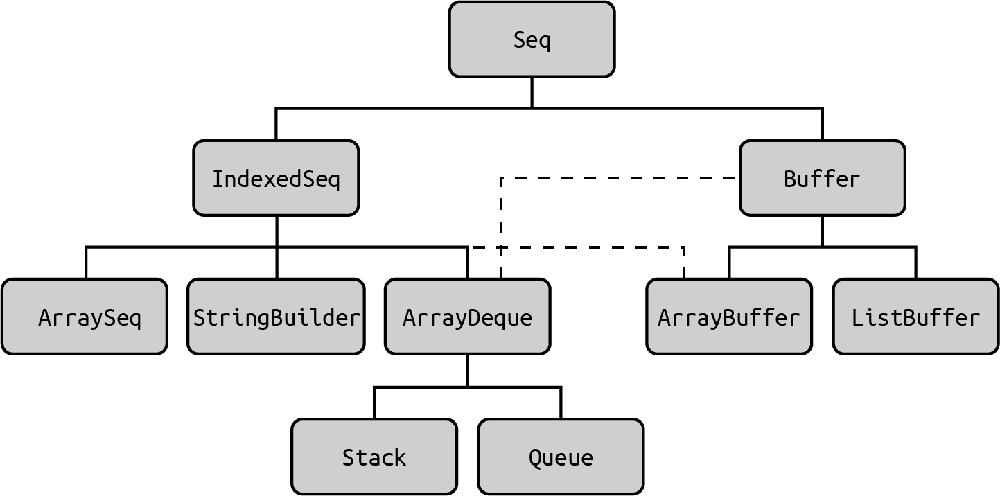
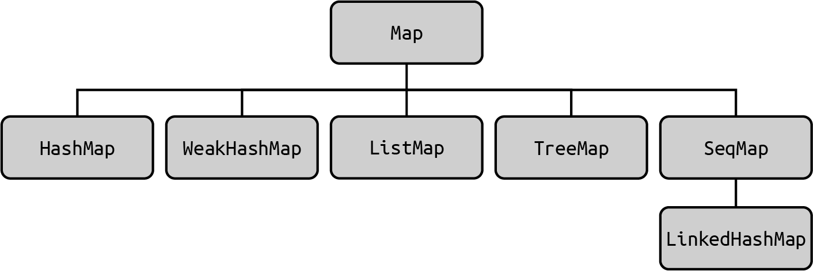
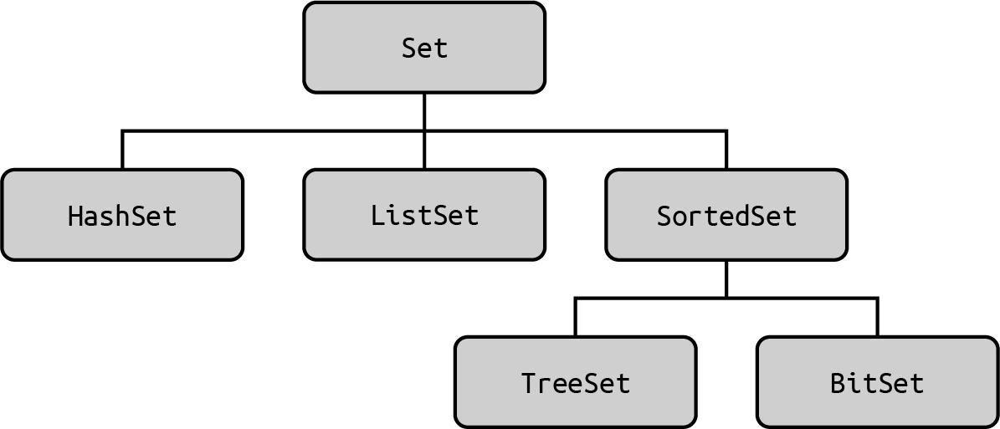

# 进度(9/20)

# 集合：介绍

这是涵盖 Scala 集合类的五章中的第一章。 因为集合对任何编程语言都非常重要，这些章节提供了深入的
覆盖了Scala 的集合类和方法。 此外，这些章节在 *Scala Cookbook* 的第二版中已经完全重新组织，以
让您更容易找到诀窍。

集合的第一章介绍了集合类。 这本章的目的是演示类是如何被组织的，并帮助您根据需要一个集合类。 例如，如果你想要一个索引，不可变的序列，推荐使用 **Vector** 作为首选序列，但如果您想用索引，可变的序列则推荐**ArrayBuffer**。

本章之后，第 12 章介绍了最常用的 Scala 序列类，包括 Vector、ArrayBuffer、List 和 Array。 其他食谱覆盖ListBuffer和LazyList。

第 13 章提供了最常用的方法，这些方法在Scala 序列类。 集合类以其内置可用的方法的深度而闻名，并且这章演示了这些方法。

第 14 章介绍了 Map 类型。 Scala Map类似于 Java Map、Ruby Hash 或Python Dictionary,因为它们由键值对组成，其中键必须唯一。 Scala 同时有可变和不可变的Map，它们都包含在这章。

最后，第 15 章介绍了其他集合类型，包括常用的Tuple和Range类型，以及Set、Queue和Stack。


## Scala不是Java

Scala的集合类丰富而深刻，并且和其他语言如Java的集合类有很大不同。在短期内，这可能是一个倒退，但从长远来看，你会欣赏到它们的优雅和内置的方法。

由于这些方法的深刻，你很少需要写(或读)自定义的for循环。事实证明，许多自定义开发循环的人员一直遵循特定的循环模式，因此这些循环被封装集合的内置方法中，如filter, map, foreach等。当第一版Scala Cookbook于2013年发布，丰富的集合方法对于有Java背景的人来说是相当震惊的，但是现在Java集合有很多函数式接口，转化会容易很多。

然而，当你开始使用Scala时，最好还是忘记Java集合类，并专注于Scala集合。例如，当Java开发人员第一次使用Scala时，他们可能会想，“好的，我要使用列表和数组，对吧? ”嗯,不,不是真的。Scala List类与Java List类非常不同，其中包括Scala List是不可变的部分。虽然Scala Array是围绕Java Array的包装器。并且提供了许多用于处理数组的内置方法，但是不推荐它作为顺序集合类。

根据我的的经验，我从 Java 转到 Scala 并一直尝试在我的Scala应用中使用 Java 集合。 这太浪费时间了。 虽然Java 集合在 Scala 中工作良好，此功能仅适用于与 Java 代码互相操作。 现在回想起来，尝试使用 Java 集合类作为我的Scala 应用程序中默认的集合只会减慢我的学习进度。与其和我一样， 我鼓励你直接正确深入和学习Scala的方式！ 本章将帮助你找到那些需要的类。

## Scala 2.13 集合全面改造

作为最后介绍性说明，Scala 2.13 版本（于 2018 年结束）以其对集合的全面改造而闻名。 而这些集合实现的”幕后“涉及特质和类型继承的重大变化，这些变化在多数情况下对用户是透明的。

这是一件好事，因为 Scala 开发人员享受集合的最终结果。因此，你使用外部 API的类，如 List、Vector、ArrayBuffer、Map 和 Set—基本保持不变。 如果有的话，Scala 2.13 和 Scala 3 已经简化了这些内部表示，因此你的代码和类型比之前都简单。

我提到这次全面改造是因为 Scala 3 很快就跟在 Scala 2.13 后面，所以随着除了元组（在 Scala 3 中已明显更新）之外，许多集合就像在 Scala 2.13 中一样工作。 同样，这是一件好事。如果你对 Scala 2.13 全面改造的细节感兴趣，这有三个很好的资源讲述这些变化背后的故事：

- [Scala 3 页面Scala 2.13的集合]()
- [Scala 3 页面关于Scala 2.13的集合架构]()
- [Scala 2.13 类层次结构概述]()

# 理解集合的层次

关于集合，需要了解的第一件事是它们都包含在表11-1的包中。一般来说，集合中的scala.collection是scala.collection.immutable和scala.collection.mutable的超类 (或者准确地说是超类型)。这意味着基本操作由scala.collection所提供。并且不可变和可变操作被添加到其它两个包的类型中。

Table 11-1.

| 字符序列                   | 描述                                                   |
| -------------------------- | ------------------------------------------------------ |
| scala.collection           | 集合是不可变或者可变的                                 |
| scala.collection.immutable | 不可变集合。创建之后永远不变。                         |
| scala.collection.mutable   | 可变集合。它们有一些（或许多）方法允许更改集合的元素。 |


## 集合是深入和广泛

Scala集合层次结构非常丰富-深入且广泛。当你选择一个类或者方法解决问题时候，理解它们如何组织的将会非常有用。图11-1显示了Vector类继承的特质，并展示了Scala集合层次结构的复杂性。


Figure11-1


因为（a）Scala类可以从traits继承，（b）精心设计的traits是粒度的，类层次结构可以如下所示。然而，不要让图11-1让你陷入困境：使用Vector不需要知道所有这些traits。事实上，使用Vector很直接：

```scala
val x = Vector(1, 2, 3)
x.sum // 6
x.filter(_ > 1) // Vector(2, 3)
x.map(_ * 2) // Vector(2, 4, 6)
x.takeWhile(_ < 3) // Vector(1, 2)
```

在高层次上，Scala的集合类以Iterable trait开始并扩展到序列(Seq)、集合(Set)和映射(Map)的三个主要类别。序列进一步分支成索引序列和线性序列，如图11-2所示。


Figure11-2

Iterable trait定义了一个迭代器，它允许你循环中一次遍历集合中一个元素。但在使用迭代器时，只能遍历集合

一次，因为每个元素都是在迭代过程中消耗的。

### Sequences

深入一点挖掘*sequence*层次结构，Scala包含大量的序列类型。最常见的不可变序列如图11-3所示，最常见的可变序列如图11-4所示。


Figure11-3  部分Scala不可变序列层次结构




Figure11-4  部分Scala可变序列层次结构


如图11-3所示，不可变序列分成两大类: 索引序列和线性序列(链表)。IndexedSeq显示元素的随机访问是有效的，例如访问Vector元素为xs(1 _000_000)。默认情况下，指定使用Scala 3的IndexedSeq将创建一个Vector：

```scala
scala> val x = IndexedSeq(1,2,3)
x: IndexedSeq[Int] = Vector(1, 2, 3)
```


LinearSeq意味着一个集合可以被有效地分割成头部和尾部组件，通常使用时候用head, tail和isEmpty方法。注意，在Scala 3中创建LinearSeq会创建一个List，这是一个单链表:

```scala
scala> val xs = scala.collection.immutable.LinearSeq(1,2,3)
xs: scala.collection.immutable.LinearSeq[Int] = List(1, 2, 3)
```


在图11-4所示的可变序列中，ArrayBuffer是最常见的。当需要可变序列时，建议使用。这里快速浏览一下
如何使用ArrayBuffer:

```scala
scala> import scala.collection.mutable.ArrayBuffer

scala> val xs = ArrayBuffer(1,2,3)
val xs: ArrayBuffer[Int] = ArrayBuffer(1, 2, 3)

scala> xs.addOne(4)
val res0: ArrayBuffer[Int] = ArrayBuffer(1, 2, 3, 4)

scala> xs.addAll(List(5,6,7))
val res1: ArrayBuffer[Int] = ArrayBuffer(1, 2, 3, 4, 5, 6, 7)
```

上面展示了addOne和addAll方法，但那是相对新添加的; 从历史上看，通常使用+=和++=也能达到上面目的:

```scala
scala> xs += 8
val res2: ArrayBuffer[Int] = ArrayBuffer(1, 2, 3, 4, 5, 6, 7, 8)
scala> xs ++= List(9,10)
val res3: ArrayBuffer[Int] = ArrayBuffer(1, 2, 3, 4, 5, 6, 7, 8, 9, 10)
```


### Maps

和Java Map、Ruby Hash或Python字典一样，Scala Map是键/值集合，其中所有键必须唯一。最常见的不可变和

可变Map类分别如图11-5和11-6所示。


Figure 11-5 常用的不可变Map类




Figure 11-5 常用的可变Map类


Map类型在Recipe 14.1“创建和使用Map”中有介绍，但只是简介。当只需要一个简单的不可变Map时，可以不需要import语句创建Map:

```scala
scala> val m = Map(1 -> "a", 2 -> "b")
val m: Map[Int, String] = Map(1 -> a, 2 -> b)
```

可变Map默认不在作用域内，必须导入或指定完整路径去使用:

```scala
scala> val mm = collection.mutable.Map(1 -> "a", 2 -> "b")
val mm: scala.collection.mutable.Map[Int, String] = HashMap(1 -> a, 2 -> b)
```

### Sets

和Java Set一样，Scala Set是包含唯一元素的集合。常用不可变的和可变**Set**类分别如图11-7和11-8所示。



Figure 11-7.  常用不可变Set类


Figure 11-8.  常用可变Set类


集合特质和类在Recipe 15.3“创建集合和添加元素”中有介绍，但作为快速浏览，如果只是需要一个不可变Set，你可以不需要import语句创建：

```scala
scala> val set = Set(1, 2, 3)
val set: Set[Int] = Set(1, 2, 3)
```

和Map一样，如果你想使用一个可变的Set，必须导入或指定完整路径去使用:

```scala
scala> val mset = collection.mutable.Set(1, 2, 3)
val mset: scala.collection.mutable.Set[Int] = HashSet(1, 2, 3)
```

总结下，以上是Scala集合层次结构的概述。


# 选择一个集合类

## 问题

你想选择Scala集合类去解决特定的问题.

## 解决方法

集合类有三大类可选择:

-  Sequence
-  Map
-  Set

Sequence是可被索引或线性(链表)的元素组成的集合，Map包含唯一键的键/值对的集合，就像Java map，
Ruby Hash，或者Python字典。集合是一个不包含重复元素的Sequence。

除了这三个主要类别外，还有其余有用的集合类型，包括Range,、Stack和Queue。其它一些有些像集合，包括
Tuples和Option、Try和Either错误处理类。

### 选择Sequence

在选择一个Sequence时(一个连续的元素集合)，有两个主要考虑:

- 序列是否应该被索引，且允许快速访问任何元素，还是应该作为一个去链表实现?
- 想要一个可变的还是不可变的集合?

从Scala 2.10到Scala 3，一般顺序集合推荐可变/不可变和索引/线性的组合，如表11-2所显示。

Table 11-2. Scala推荐的通用目的顺序集合

|                       | Immutable | Mutable     |
| --------------------- | --------- | ----------- |
| Indexed               | Vector    | ArrayBuffer |
| Linear (Linked lists) | List      | ListBuffer  |

读取表可以作为一个例子，如果你想要一个不可变的，索引的集合一般来说，应该使用Vector，如果您想要一个可变的、索引的集合，请使用ArrayBuffer等。

虽然这是一般性的建议，但是序列还有更多可选项。Table 11-3中显示了最常见的不可变序列的选项。


### 选择Map


### 选择Set


## 另见


# 理解集合的性能

## 问题

## 解决方法

## 讨论

## 另见


# 理解可变变量与不可变集合

## 问题

## 解决方法

## 讨论


# 在集合上创建惰性视图

## 问题

## 解决方法

## 讨论


