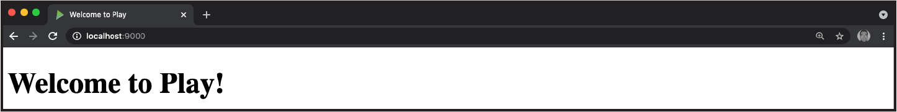

# 19. Play 框架和 Web 服务

本章的各小节展示了如何使用Scala开发Web服务，包括处理服务器端的HTTP请求，在JSON和Scala对象之间进行转换，以及编写客户端的HTTP请求等比较常用的场景。

到2021年，有一些很棒的库可以用Scala进行服务器端开发，可以在Awesome Scala列表(*https://oreil.ly/rC08K*)中找到这些库。本章重点介绍Play框架（Play），因为它很流行，支持度高，而且相对容易上手，特别是如果以前使用过Ruby on Rails这样的框架的话就更简单了。

注意，在本书编写之时，Play还没有更新到支持Scala 3。因此，在本章中看到的Play示例使用的是Scala 2语法。也就是说，Play的API已经相当稳定，可以追溯到2013年和*Scala Cookbook*第一版的发布，因此，当Play支持Scala 3时，这些例子有望很好地转化为支持Scala 3。

本章的前几个小节侧重于使用 Play 的服务器端开发。这些小节包括：

- 小节19.1，创建第一个Play项目
- 小节19.2，创建一个新的端点，即一个服务器端REST服务的URL
- 小节19.3，从Play GET请求返回一个JSON
- 小节19.4，将Scala对象转换为JSON
- 小节19.5，将JSON转换为Scala对象

然后，最后两个小节展示了可用于服务器端或客户端开发的技术：

- 小节19.6，在Play框架外使用Play JSON库
- 小节19.7，使用sttp HTTP客户端

## 19.1 创建一个Play框架项目

### 问题

这一章大部分小节使用Play 框架（Play），如果之前没用过Play，需要知道如何创建一个新的Play项目。

### 解决方案

创建一个新的Play项目的最简单方法是使用sbt种子模板：

```
    $ sbt new playframework/play-scala-seed.g8
```

当该命令运行时，只需要给它一个项目名称和组织名称，然后 **cd** 进入新的目录，如下所示：

```
    $ sbt new playframework/play-scala-seed.g8 
    [info] Set current project to play ...
    This template generates a Play Scala project

    name [play-scala-seed]: hello-world 
    organization [com.example]: com.alvinalexander

    Template applied in hello-world

    $ cd hello-world
```

然后在该项目目录下，运行 **sbt run** 命令：

```
    $ sbt run 
    // a LOT of output here ...
    [info] loading settings for project hello-world-build from plugins.sbt ... 
    [info] loading settings for project root from build.sbt ...
    [info] set current project to hello-world ...
    
    --- (Running the application, auto-reloading is enabled) --
    [info] p.c.s.AkkaHttpServer - Listening for HTTP on /0:0:0:0:0:0:0:0:9000 
    (Server started, use Enter to stop and go back to the console...)
```

第一次运行该命令时，会有很多输出，如果以最后三行结束，这表明Play服务器在9000端口运行：

现在，当在浏览器中打开 *http://localhost:9000* URL时，会看到一个 "Welcome to Play "的网页，看起来像图19-1中的页面那样。



图19-1，*"欢迎来使用Play！"欢迎页*

如果需要在9000以外的端口运行Play，请在你的操作系统命令行中使用这个命令：

```
    $ sbt "run 8080"
```

或者在sbt shell中使用如下命令：

```
    sbt> run 8080
```

### 讨论

一个Play应用程序由以下组件组成：

- sbt *build.sbt* 文件，包含应用程序的依赖和其他配置信息。
- 放在 *app/controllers* 文件夹中的控制器。
- 在app/models文件夹中的模型。这个文件夹通常不会自动创建。
- 包含HTML、JavaScript、CSS和Scala代码片段的模板被放在 *app/views* 文件夹中。
- 一个 *conf/routes* 文件，里面有将URI和HTTP方法映射到控制器方法。

其他重要的文件包括：

- *conf/application.conf* 文件中的应用程序配置信息。这里包括关于如何访问数据库的信息。
- 在 *conf/evolutions* 文件夹中的数据库演化脚本。
- 模板文件的设计资源被放在 *public/images* 、*public/javascripts* 和 *public/stylesheets* 文件夹中。

因为本章是关于构建Web服务的，而不是Web 1.0应用程序，所以主要关注的是这些目录和文件：

- *conf/routes* 路由文件
- 在 *app/controllers* 自定义的控制器

#### *conf/routes* 文件

要了解项目中的文件，首先看conf/routes文件。当前的Play 2.8模板创建了一个具有以下内容的文件：

```
    # Routes 
    # This file defines all application routes (Higher priority routes first) 
    # https://www.playframework.com/documentation/latest/ScalaRouting
    
    # An example controller showing a sample home page 
    GET / controllers.HomeController.index
    
    # Map static resources from the /public folder to the /assets URL path 
    GET /assets/*file controllers.Assets.versioned(path="/public", file: Asset)
```

要了解欢迎页面是如何显示的，这是该文件中这重要的一行：

```
    GET / controllers.HomeController.index
```

这一行可以理解为："当以HTTP GET方法请求/ URI上时，调用 *控制器* 包中的 **HomeController** 类中定义的 **index** 方法"。如果使用过Ruby on Rails等其他框架，就见过这种东西。它将特定的HTTP方法（如GET或POST）和URI绑定到一个类中的方法。

关于路由的两件重要的事情是：

-  *conf/routes* 文件被编译了，所以可以在浏览器中直接看到路由错误。
- 正如将在控制器类代码中看到的，它使用了依赖注入。根据Play文档，"Play的默认路由生成器创建了一个路由器类，在 **@Inject-annotated** 构造函数中接受控制器实例。这意味着该类适合使用依赖注入，也可以使用构造函数手动实例化。"

#### 控制器

接下来，打开 *app/controllers/HomeController.scala* ，查看其 **index** 方法：

```
    package controllers
    import javax.inject._ 
    import play.api._ 
    import play.api.mvc._
    
    /**
     * This controller creates an `Action` to handle HTTP requests to the 
     * application's home page.
     */
    @Singleton 
    class HomeController @Inject()(val controllerComponents: ControllerComponents)          
    extends BaseController {
    
      /** 
       * Create an Action to render an HTML page.
       * 
       * The configuration in the `routes` file means that this method 
       * will be called when the application receives a `GET` request with 
       * a path of `/`.
       */
      def index() = Action { implicit request: Request[AnyContent] =>
        Ok(views.html.index()) 
      }
    }
    
```

这是一个普通的Scala源代码文件，有一个名为 **index** 的方法。这个方法通过调用一个名为 **Ok** 的方法实现一个Play **Action** ，并传入需要显示的内容。代码 **views.html.index** 是Play对 *app/views/index.scala.html* 模板文件的引用。Play架构的一个超棒的功能是，Play模板被编译为Scala函数，所以在这段代码中看到的是一个普通的函数调用：

```
    Ok(views.html.index())
```

这段代码就是调用 *views.html* 包中一个名为 **index** 的函数。

#### view 模版

在明白了模板会编译成一个普通的Scala函数之后，打开 *app/views/ index.scala.html* 模板文件，可以看到以下内容：

```
    @()
    
    @main("Welcome to Play") { 
      <h1>Welcome to Play!</h1> 
    }
```

注意这段代码的第一行

```
    @()
```

如果把模板看成一个函数，这就是函数的参数列表。在这个例子中，参数列表是空的，但如果这个模板有一个名字为 **message** 的字符串参数，这一行就会是这样的：

```
    @(message: String)
```

文件中的 **@** 符号是Play模板文件中的一个特殊字符。它表示它后面的内容是一个Scala表达式。例如，在所示的这行代码中，**@** 字符在函数参数列表之前。在第三行代码中，**@** 字符在调用一个名为 **main** 的函数之前。注意在这行代码中，字符串 "Welcome to Play "被传递到 **main** 方法中。

可能细心的读者已经猜到了，虽然 **main** 看起来像一个函数，但它也是一个模板文件。当代码调用 **main** 时，它实际上调用了 *app/views/main.scala.html* 模板。下面是 *main.scala.html* 的默认源代码：

```
    @(title: String)(content: Html)

    <!DOCTYPE html>
    <html lang="en">
        <head>
            @* Here's where we render the page title `String`. *@ 
            <title>@title</title>
            <link rel="stylesheet" media="screen"
                href="@routes.Assets.versioned("stylesheets/main.css")">
            <link rel="shortcut icon" type="image/png"
                href="@routes.Assets.versioned("images/favicon.png")">
        </head> 
        <body>
            @* And here's where we render the `Html` object containing 
            * the page content. *@ 
            @content
            
        <script src="@routes.Assets.versioned("javascripts/main.js")"
            type="text/javascript"></script>
        </body>
    </html>
```

这个文件是项目的默认包装模板文件。如果其他每一个模板文件都以 *index.scala.html* 文件的方式调用 **main** ，那么可以放心，这些模板都会被这个相同的HTML、CSS和JavaScript包裹起来。因此，所有的页面都会有相同的视觉体验。

在本章的课程中，其实是不需要知道这些细节，但在这里展示这两个初始文件，为了让读者更清楚了解web应用在Play中的样子。

#### 单页应用——（TODO：鸟图）

这里说的 "web应用 "，指的是用HTML编写的应用——或者在这里的情景中，指的是支持HTML和Scala片段混合的模板系统——在HTML中添加JavaScript和CSS。对于用JavaScript编写的单页应用程序（SPA），想在服务器端使用Play，可以不用对Scala的模板系统有更多了解。

#### sbt/Play 控制台

当在开发一个应用程序时，在项目的根目录下启动sbt：

```
    $ sbt
```

在这里可以运行所有常规的sbt命令，也可以启动应用程序。如解决方案中所示，该命令在默认的9000端口上启动应用程序：

```
    [play01] $ run

    (lots of output here ...)
    --- (Running the application, auto-reloading is enabled) --
    [info] p.c.s.AkkaHttpServer - Listening for HTTP on /0:0:0:0:0:0:0:0:9000 
    (Server started, use Enter to stop and go back to the console ...)
```

sbt输出的最后一行显示，可以按下Enter键停止服务器并返回到sbt提示。

正如在下面的一些小节中所示，也可以在sbt里面发出一个 **console** 命令：

```
    sbt> console 
    [info] Starting scala interpreter...
    Welcome to Scala 2.13 Type in expressions for evaluation. Or try :help.
    
    scala> _
```

这将启动一个Scala REPL，加载所有项目的依赖。在这里，可以测试Play JSON代码和其他Play代码，包括使用自定义类、模型等。

### 另见

- 更多关于 "开始使用"的信息，请参看Play Framework网站。
- 虽然它是为Play的早期版本写的，但我的Play框架食谱小册子可以在这（*https://alvinalexander.com/scala/scala-cookbook-play-framework-recipes-pdf-ebook/*）免费下载。
- 更多关于如何使用sbt的例子，见第17章。
- 关于如何使用Scala.js创建单页应用程序的细节，请参见21.3小节，"用Scala.js构建单页应用程序"。

## 19.2 创建新的Play框架端点

### 问题

当把Play作为一个单页应用程序的RESTful服务器时，要创建一个新的端点（在谈论REST服务时，这个术语也被称为URL、URI或路由）。

### 解决方案

在Play应用程序中创建一个新的端点涉及到创建一个新的路由，一个控制器方法，通常是创建新的模型或将其添加到一个现有的模型。具体步骤如下：

1. 在 *conf/routes* 文件中创建一个新路由。
2. 新的路由指向一个控制器方法，所以要创建这个控制器方法；如果控制器类还不存在，也要创建这个控制器类。
3. 控制器方法通常需要一个模型类，所以需要视情况来创建该模型类。
4. 测试新服务。

为了演示这个过程，这里将在前面的配方中创建的骨架项目上演示。在这个解决方案中，将创建新的代码，响应 */hello* URI的GET请求。当收到该请求时，控制器方法会返回一个响应为 *text/plain* 的字符串。

#### 1. 创建一个新路由

首先，这里需要在 */hello* 处理一个新的URI，所以在 *conf/routes* 文件中添加一个新的路由。因为这是一个HTTP GET请求，所以通过在文件末尾添加以下行来映射URI：

```
    # our app 
    GET /hello controllers.HelloController.sayHello
```

这里可以理解为："当在/hello URI上接收到一个GET请求时，调用控制器包中 **HelloController** 类的 **sayHello** 方法。"

#### 2. 创建一个新的控制器方法

接下来，在 *app/controllers* 目录下的 *HelloController.scala* 文件中创建 **HelloController** 类。在该类中添加以下代码：

```
    package controllers
    
    import javax.inject._
    import play.api._ 
    import play.api.mvc._ 
    import models._
    
    @Singleton 
    class HelloController @Inject()(val controllerComponents: ControllerComponents)
    extends BaseController {
        
        def sayHello() = Action { 
            Ok("Hello, world") 
        }
    }
```

当这个类中的 **sayHello** 方法被调用时，它将返回一个 **Action** 的实例，以 **Ok** 方法的实现它。这段代码在讨论中将有所解释。

#### 3. 创建模型

在大多数实际情况中，会创建一个模型类和数据库相关的代码，但对于像这样的小例子来说，并不需要这样。

#### 4. 测试服务

有了这些部件——因为这是一个简单的GET请求，不用向服务器传递cookies或头信息——可以直接在浏览器中测试。在的浏览器中输入 *http://localhost:9000/hello* URI，在那里应该看到打印出 **Hello, world** 。

也可以用 **curl** 这样的命令行工具来测试：

```
    $ curl --request GET http://localhost:9000/hello
    Hello, world
```

如果想看Play返回的HTTP 响应头，使用 **curl --head** 命令：

```
    $ curl --head http://localhost:9000/hello 
    HTTP/1.1 200 OK 
    Date: (the date and time are shown here) 
    Content-Type: text/plain; charset=UTF-8 Content-Length: 12 
    (other headers have been omitted)
```

注意，当一个 **字符串** 被传入 **Ok** 时，Http 响应的 Content-Type 被自动设置为 **text/plain** 。

### 讨论

当查看 **sayHello** 方法时，可以看到它返回一个Play **Action** ：

``` 
    def sayHello() = Action { 
        Ok("Hello, world") 
    }
```

**Action** 是一个处理请求并创建一个结果并发送到客户端的函数。更具体地说，**Action** 是一个接收请求并返回结果的函数。它的签名是这样的：

```
    play.api.mvc.Request => play.api.mvc.Result
```

在这个例子中，并不处理 **Request** ，而 **Result** 是返回给客户端的值。它代表创建的HTTP响应。

#### 解释下Ok方法

作为 **sayHello** 方法的最后一行使用的 **Ok** 方法构建了一个 "200 OK "的响应。在Action里面使用Ok，相当于写了这段更长的代码：

```
    def sayHello = Action {
      Result( 
        header = ResponseHeader(200, Map.empty), 
        body = HttpEntity.Strict( 
            ByteString("Hello, world"), 
            Some("text/plain") 
        ) 
      )
    }
```

除了 **Ok** ，其他常见的响应方法包括 **Forbidden** , **NotFound** , **BadRequest** , **MethodNotAllowed** 和**Redirect** 。也可以像这样手动设置状态代码:

```
    Status(5150)("Van Halen status")
```

当访问端点时，该方法的输出结果看起来会像这样：

```
    $ curl http://localhost:9000/hello 
    Van Halen status
    
    $ curl --head http://localhost:9000/hello 
    HTTP/1.1 5150 
    (other output not shown)
```

所有可用的辅助方法都可以在 **play.api.mvc.Results** 的 Scaladoc 中找到。

#### 这段代码响应了一个简单的GET请求

注意，所展示的代码响应的是一个简单的GET请求——它不期望从客户端获得任何参数。例如，如果用查询参数调用URL，Play会忽略它们。

```
    $ curl --request GET "http://localhost:9000/hello?x=1&y=2" 
    Hello, world
```

在 *conf/routes* 文件中配置服务可以处理哪些参数，由于这里没有声明 */hello*  URI需要任何参数，所以传递给它的参数被忽略了。

此外，如果试图使用其他方法来调用这个URI，如PUT、POST、DELETE或其他非GET方法，Play将抛出一个错误：

```
    $ curl --request POST http://localhost:9000/hello 
    (long error message here ...)
```

#### 处理查询参数

要用GET请求处理查询参数，请遵循以下步骤：

**1. 创建一个新路由。** 在 *conf/routes* 文件的末尾为新服务添加一行，定义它接受一个名为 **name** 的参数：

```
    GET /hi/:name controllers.HelloController.sayHi(name: String)
```

这一行可以理解为："当一个GET请求到达 */hi* URI上并带有 **name** 参数时，将这个 **name** 传递给 **HelloController** 的 **sayHi** 方法。"

**2. 创建一个新的控制器方法。** 接下来，更新 **HelloController** 类。在原来的 **sayHello**方法之后添加这个新的 **sayHi** 方法：

```
    def sayHi(theName: String) = Action { 
        Ok(s"Hi, $theName") 
    }
```

注意，这个方法需要一个字符串参数，而且它不需要和 *路由* 文件中使用的名称相同。

**3. 创建一个模型** 这个例子中不需要创建模型，跳过。

**4. 测试服务** 通过在浏览器中输入这个URL或使用 **curl** 来测试这个新服务：

```
    $ curl --request GET http://localhost:9000/hi/Darja 
    Hi, Darja
```

用 Play 处理路由和查询参数的方法还有几种。详情请参见 Play Scala HTTP Routing 页面。

### 另见

- 关于创建Action和控制器的更多细节，请参见 Play Framework on actions, controllers, and result （*https://oreil.ly/FKnQR*）的页面。
- 关于定义路由的更多细节，请参见Play的Scala HTTP路由（*https://www.playframework.com/documentation/2.8.x/ScalaRouting*）页面。

## 19.3 让Play使用JSON作为GET请求的返回

### 问题

如何编写一个Play Framework控制器方法，使用JSON作为响应GET请求的返回。

### 解决方案

一般的解决方案是这样的：

1. 在 *conf/routes* 文件中添加一个条目来定义新的端点。
2. 创建一个符合该文件描述的控制器类和方法。
3. 创建对应的模型，以及将该模型序列化为JSON的代码。
4. 用浏览器，或像curl这样的工具来测试新服务。

前三个步骤可以按任何顺序进行。一般来说，要么从定义端点到模型，如上面所示，或者从定义模型到定义端点。

#### 1.在routes文件中添加一个条目

按照上面所示的步骤，这个解决方案首先创建端点，然后创建完成该服务所需的一切。第一步是在 *conf/routes* 文件中添加下面代码，以创建该端点：

```
    GET   /movies   controllers.MovieController.getMovies
```

这可以理解为 "当在 */movies*  URI有一个GET请求时，调用 **控制器** 包中 **MovieController** 类中的 **getMovies** 方法"。

#### 2 创建控制器和方法

接下来，在 **MovieController** 类中创建 **getMovies** 方法。为了使这个方法最初尽可能的简单，代码将把一个字符串列表——电影的名字列表——转换成JSON，然后返回JSON。电影列表和JSON转换过程就在这个控制器代码中：

```
    package controllers
    import javax.inject._ 
    import play.api.mvc._ 
    import play.api.libs.json._ 
    import models.Movie
    
    @Singleton 
    class MovieController @Inject()(val controllerComponents: ControllerComponents) 
    extends BaseController {
    
        /** 
         * Let Play convert the `List[String]` to JSON for you. 
         */ 
        def getMovies = Action {
            // these three steps are shown explicitly so you
            // can see the types:
            val goodMovies: Seq[String] = Movie.goodMovies()
            val json: JsValue = Json.toJson(goodMovies)
            Ok(json)
        }
    }
```

关于上面的代码的说明：

- 这是一个新的控制器，就像前面的小节中创建的一样。
- **Json.toJson** 方法知道如何将一个 **Seq[String]** 转换为JSON。
- **Ok** 方法构建了一个 "200 OK的响应"。

最后两点将在讨论中详细说明。

#### 3.创建模型

现在要做的就是创建一个模型来匹配上面那段代码：

```
    package models
    
    object Movie { 
        def goodMovies(): Seq[String] = List( 
            "The Princess Bride", 
            "The Matrix", 
            "Firefly" 
        )
    }
```

实际上——在后面的小节中——模型将更加复杂。但是为了使这个例子尽可能的简单， **goodMovies** 被定义为一个返回 **List[String]** 的方法。(在实际工程中，**goodMovies** 会从数据库或其他数据存储中获取这些数据。）

#### 4. 用浏览器或curl访问端点

对于这样一个没有向服务器传递任何自定义头信息的GET请求，可以直接用浏览器测试。只要在浏览器中访问 *http://localhost:9000/movie* ，应该可以看到这样的JSON输出：

```
    ["The Princess Bride","The Matrix","Firefly"]
```

也可以使用像 **curl** 这样的命令行工具：

```
    $ curl --request GET http://localhost:9000/movies
    ["The Princess Bride","The Matrix","Firefly"]
```

如果看到了上面那样的输出，那么就可以确认使用Play 创建了一个使用JSON作为输出的响应GET请求的Action。

### 讨论

这里来看看控制器代码是如何工作的。

#### Json.toJson

**Json.toJson** 方法知道如何将一个字符串列表——电影字符串列表——转换成JSON：

```
    val json: JsValue = Json.toJson(goodMovies)
```

Scala 2中toJson方法是这样定义的：

```
    Json.toJson[T](T)(implicit writes: Writes[T])
```

如小节19.4所示， **Writes** 值是一个转换器，它知道如何将Scala各种类型转换为JSON。Play为 **Int**、**Double** 、**String** 等基本类型预制了Writes转换器。当在倒入play.api.libs.json._包时，这些转换器会被导入到当前作用域中。

它对 *集合* 也有隐式的 **Writes** 实现，所以如果一个类型 **A** 有 **Writes[A]** 转换器， **Json.toJson** 方法可以转换包含该类型 **A** 的集合。在这个例子中，Play提供了一个 **Writes[String]** 转换器，所以它也可以转换 **Seq[String]** 。

#### Ok方法

作为 **getMovies** 方法的最后一行， **Ok** 方法构建了一个 "200 OK "的响应。这相当于写了这样的代码：

```
    def index = Action {
      Result( 
        header = ResponseHeader(200, Map.empty), 
        body = HttpEntity.Strict(
            //JSON here ...
            Some("application/json")
        )
      )
    }
```

如上所示，当 **Ok** 返回一个 **JsValue** 对象时，它将HTTP 的 content-type 设置为 "**application/json**"。可以在 **curl** 命令的输出中确认这一事实：

```
    $ curl -I http://localhost:9000/movies 
    HTTP/1.1 200 OK 
    Content-Type: application/json
    Content-Length: 45 
    (other output not shown)
```


#### Play JSON类型

像其他JSON框架一样，Play有对应于JSON类型的类型实现：

- **JsString**
- **JsNumber**
- **JsObject**
- **JsNull**
- **JsBoolean**
- **JsArray**
- **JsUndefined**

这些类型中的每一个都是 **JsValue** 的一个子类型。注意，**JsArray**是一个序列，可以包含其他 **JsValue** 类型的异构或同构的集合。

这些类型在 **play.api.libs.json** 包中，可以通过导入 **play.api.libs.json._** 然后在代码中使用它们。

#### 如何在Scala REPL中使用Play/JSON

可以在Play/sbt REPL中测试这些类型是如何工作的。想要测试这些类型，首先得在Play项目的根目录下启动sbt：

```
    $ sbt
```

然后在sbt shell里面，使用 **console** 命令：

```
    sbt> console
```

这将启动一个Scala REPL。除了是一个普通的 REPL 之外，还可以访问 classpath 上项目里的所有类。所以可以像这样导入JSON类型：

```
    scala> import play.api.libs.json._
```

然后可以运行各种小实验。这些例子展示了可以执行的一些表达式，以及它们的结果类型：

```
    JsString("hi")              // JsString = "hi"
    JsNumber(100)               // JsNumber = 100
    JsNumber(1.23)              // JsNumber = 1.23
    JsNumber(BigDecimal(1.23))  // JsNumber = 1.23
    JsBoolean(true)             // JsBoolean = true
    
    val x = Json.toJson(4)      // JsValue = 4
    val x = Json.toJson(false)  // JsValue = false
    
    // Sequences 
    Json.toJson(Seq("A", "B", "C"))    // JsValue = ["A","B","C"]
    JsArray(Array(Json.toJson(1)))     // JsArray = [1]
    JsArray(Seq(Json.toJson("Hi")))    // JsArray = ["Hi"]
    JsArray(Array(1))                  // does not compile
    
    // Map
    val map = Map("1" -> "a", "2" -> "b")
    Json.toJson(map)  // JsValue = {"1":"a","2":"b"}
    
    // Some
    val number = Json.toJson(Some(100))   // JsValue = 100
    val number = Json.toJson(Some("Hi"))  // JsValue = "Hi"
    
    // None 
    val x: Option[Int] = None 
    val number = Json.toJson(x)           // JsValue = null
```

### 另见

- play.api.libs.json Scala文档。（*https://oreil.ly/8xjPm*）

## 19.4 将Scala对象序列化成JSON字符串

### 问题

如何使用Play将Scala对象转换成一个JSON字符串

### 解决方案

首选的方法是为类创建一个隐式的 **Writes** 转换器，然后使用 **Json.toJson** 方法将类转换（序列化）为一个JSON字符串值。

举个例子，假定有这么一个 **Movie** 类：

```
    case class Movie(title: String, year: Int, rating: Double)
```

像下面这样创建一个 **Movie** 的隐式 **Writes** ：

```
    import play.api.libs.json._
    
    implicit val movieWrites = new Writes[Movie] { 
        def writes(m: Movie) = Json.obj( 
            "title" -> m.title, 
            "year" -> m.year, 
            "rating" -> m.rating 
        )
    }
```

现在可以创建这样一个实例：

```
    val pb = Movie("The Princess Bride", 1987, 8.5)
```

然后使用 **Json.toJson** 将其转换成JSON：

```
    scala> val json = Json.toJson(pb) 
    val json: play.api.libs.json.JsValue =
        {"title":"The Princess Bride","year":1987,"rating":8.5}
```

#### 对象序列

这种方法的一个好处是，它也适用于对象的集合。假设创建一个这样的集合：

```
    val goodMovies = List( 
        Movie("The Princess Bride", 1987, 8.5), 
        Movie("The Matrix", 1999, 8.8), 
        Movie("Firefly", 2002, 9.2) 
    )
```

然后将其序列化为JSON：

```
    scala> val json = Json.toJson(goodMovies)
    val json: play.api.libs.json.JsValue = [
        {"title":"The Princess Bride","year":1987,"rating":8.5},
        {"title":"The Matrix","year":1999,"rating":8.8},
        {"title":"Firefly","year":2002,"rating":9.2} 
    ]
```

就像在后面讨论中那样，这种方法也适用于嵌套对象。

### 讨论

这种方法是可行的是因为 **Json.toJson** 被设计成使用一个隐式的 **Writes** 值，这个值在当前的作用域内是有效的：

```
    Json.toJson[T](T)(implicit writes: Writes[T])
```

**Writes** 是 **play.api.libs.json**  包中的一个特质，当为类定义一个像这样隐式的 **Writes** 实例：

```
    implicit val movieWrites = new Writes[Movie] ...
```

然后将它导入到当前的作用域中，**Json.toJson** 方法就可以进行转换了。如解决方案中所示，它对一个类的单个实例和该类型的集合都有效。

#### 嵌套对象

同样 **Writes** 技术也支持嵌套对象。例如，给定这两个样例类：

```
    case class Address( 
        street: String, 
        city: String, 
        state: String, 
        postalCode: String 
    )
    
    case class Person(name: String, address: Address)
```

可以创建隐式 **Writes** 来对其进行转换：

```
    object WritesConverters { 
        import play.api.libs.json._
        
        implicit val addressWrites = new Writes[Address] { 
            def writes(a: Address) = Json.obj( 
                "street" -> a.street, 
                "city" -> a.city, 
                "state" -> a.state, 
                "postalCode" -> a.postalCode, 
            )
        }

        implicit val personWrites = new Writes[Person] { 
            def writes(p: Person) = Json.obj( 
                "name" -> p.name, 
                "address" -> p.address 
            )
        }
    }
```

然后，在将它们导入作用域后，可以创建一个包含 **Address** 的 **Person** 实例，并把 **Person** 转换为JSON。这个过程在下面这段代码中展示：

```
    object JsonWrites2AddressPerson extends App {
    
        import WritesConverters._
        val stubbs = Person(
            "Stubbs", 
            Address(
                "123 Main Street", 
                "Talkeetna", 
                "Alaska", 
                "99676" 
            )
        )
        
        val jsValue = Json.toJson(stubbs) 
        println(jsValue)
    }
```

当该代码运行时，你会看到 **jsValue** 有这样的类型和数据：

```
    jsValue: JsValue = {
        "name":"Stubbs", 
        "address":{ 
            "street":"123 Main Street", 
            "city":"Talkeetna", 
            "state":"Alaska",
            "postalCode":"99676" 
        } 
    }
```

#### 其他可以使用的方式

通过Play，可以使用其他方法将Scala对象序列化为JSON，但 **Writes** 的方法很直接，所以使用其他方法似乎并没有很大的优势。

这里简略看下其他转换方式，这段代码显示了将名为 **m** 的 **Movie** 实例转换为 **JsValue** 的另一种方法：

```
    import play.api.libs.json._
    
    val json: JsValue = JsObject( 
        Seq(
            "title" -> JsString(m.title),
            "year" -> JsNumber(m.year), 
            "rating" -> JsNumber(m.rating) 
        ) 
    )
```

有关其他转换方法的详情，请参见Play关于JSON的文档（*https://oreil.ly/bZUdm*）

## 19.5 将JSON反序列化成Scala对象

### 问题

当Play接收到一个与Scala类对应的JSON时，如何将其转换成一个Scala对象，当然也有可能是一个Scala对象集合。

### 解决方案

将单个JSON转换成Scala对象的将在下面展示。将JSON转换成一个对象集合则会在讨论中展示。

要将JSON字符串转换为单一的Scala对象，可以参展以下步骤：

1. 创建一个与JSON对应的类。
2. 创建一个Play **Reads** 用于转换。
3. 在Play控制器方法中接收JSON。
4. 将JSON字符串转换为Scala对象，并在此过程中验证JSON正确性。

这基本上是将前一个小节对应的方法反了过来，增加了验证的步骤。前面的小节使用隐式的**Writes**，而这里则使用隐式的 **Reads** 。

#### 1. 创建一个与JSON对应的Scala类

例如，假设有这样一个JSON字符串用来代表一个 **Movie** ：

```
    val jsonString = """{"title":"The Princess Bride","year":1987,"rating":8.5}"""
```

创建一个样例类来与这个JSON对应：

```
    case class Movie(title: String, year: Int, rating: Double)
```

#### 2. 创建一个 Reads 用于转换

然后为 **Movie** 创建一个隐式的 **Reads** 转换器：

```
    import play.api.libs.json._
    import play.api.libs.functional.syntax._
    
    // conversion without validation
    implicit val movieReads: Reads[Movie] = (
        (JsPath \ "title").read[String] and
        (JsPath \ "year").read[Int] and
        (JsPath \ "rating").read[Double] 
    )(Movie.apply _)
```

不考虑验证的情况，这里已经可以使用 **Json.fromJson** 将JSON字符串转换成Scala的 **Movie** 对象了：

```
    val json: JsValue = Json.parse(jsonString)
    
    val movie = Json.fromJson(json)
    // JsResult[Movie] = JsSuccess(Movie(The Princess Bride,1987,8.5),)
```

然而，在实际工程中总是需要验证进入应用程序的外部数据，所以需要为每个值添加验证：

```
    // conversion with validation.
    // minLength, min, and max are validation methods that come with
    // the Reads object.
    import play.api.libs.json._
    import play.api.libs.functional.syntax._
    import play.api.libs.json.Reads._
    
    implicit val movieReads: Reads[Movie] = ( 
        (JsPath \ "title").read[String](minLength[String](2)) and 
        (JsPath \ "year").read[Int](min(1920).keepAnd(max(2020))) and 
        (JsPath \ "rating").read[Double](min(0d).keepAnd(max(10d))) 
    )(Movie.apply _)
```

像 **min** 、**minLength** 和 **max** 这样的函数是 **Reads** 对象自带的辅助验证方法，这些例子展示了如何将它们应用于三个传入的字段。

可读性 （松鼠图）

如果代码在添加验证器时变得太难读，可以考虑一次只处理一个 **JsPath** 字段。

#### 3. 在Play控制器方法中接收JSON

这个步骤在本小节中没有使用，但如果想在控制器的方法使用请参见讨论。

#### 4. 将JSON转换为Scala对象

现在可以尝试解析和验证JSON，构建一个Scala对象：

```
    val json: JsValue = Json.parse(jsonString) 
    val jsResult = json.validate[Movie]
```

当验证成功时，**jsResult** 的类型和值是：

```
    jsResult: JsResult[Movie] = JsSuccess(Movie(The Princess Bride,1987,8.5),)
```

处理 **jsResult** 值的一种方法是使用 **匹配** 表达式——它是 **JsSuccess** 或 **JsError** ：

```
    jsResult match { 
        case JsSuccess(movie,_) => println(movie) 
        case e: JsError => println(s"error: $e") 
    }
```

这是一种最常见的处理方法，**JsResult** 类型也有其他方法可以使用，包括 **asOpt** 、 **fold** 、**foreach** 和**getOrElse** 。

### 讨论

这个解决方案与上一个小节类似，但这个小节讲的不是从Scala对象到JSON字符串，而是从JSON字符串到Scala对象。上一个小节使用了隐式 **Writes** 转换器和 **Json.toJson** 方法，这个小节使用了隐式 **Reads** 转换器和**Json.fromJson** 和 **json.validate** 方法。

#### JSON和控制器方法

控制器方法在19.1小节和19.2小节已经展示过这里就不做赘述。

当在控制器方法中处理JSON时，需要对请求对象进行操作，像下面这样：

```
    // one option 
    def yourMethod = Action { request: Request[AnyContent] =>
        val json: Option[JsValue] = request.body.asJson
        // more the json here ... 
    }
    
    // another option ("body parser") 
    def yourMethod = Action(parse.json) { request: Request[JsValue] =>
        // work with 'request' as JSON here
        val name = request.body \ "username").as[String] 
    }
```

关于使用 **Action** 、JSON和 *body parsers* 的更多细节，请参见Play Framework文档。

#### 使用 JsPath

解决方案中展示的模式被称为 *组合子模式* 。

```
    (JsPath \ "title").read[String] and 
    (JsPath \ "year").read[Int] and 
    (JsPath \ "rating").read[Double]
```

在这段代码中，**JsPath** 是一个代表 **JsValue** 路径的类，即它在 **JsValue** 结构中的位置。它用来像XPath处理XML那样来处理JSON的，并且它提供的搜索模式来遍历JsValue结构。

对于嵌套对象，可以这样来搜索路径：

```
    val city = JsPath \ "address" \ "city"
```

对于对象的序列，像这样访问序列元素：

```
    val friend0 = (JsPath \ "friends")(0)
```

更多 **JsPath** 的细节，请参见Play文档中关于 Reads/Writes/Format 组合子中的的 "Reads"部分。

#### 处理验证失败的数据

当收到的数据没有通过验证过程，**validate** 会返回一个 **JsError** 。例如，这个JSON字符串使用了不正确的键名**name** 而不是 **title** ：

```
    // intentional mistake here (using 'name' instead of 'title'):
    val jsonString = """{"name":"The Princess Bride","year":1987,"rating":8.5}"""
```

所以当运行 **validate** 方法时，它会返回一个 **JsError** ：

```
    scala> json.validate[Movie]
    val res0: play.api.libs.json.JsResult[Movie] =
      JsError(List((/title,List(JsonValidationError(List(error.path.missing),
      ArraySeq())))))
```

现在，当使用 **匹配** 表达式时，就会触发 **JsError** 的 case语句：

```
    jsResult match { 
        case JsSuccess(movie,_) => println(movie) 
        case e: JsError => println(s"error: $e") 
    }
    // output:
    JsError(List(
    (/title,List(JsonValidationError(List(error.path.missing),ArraySeq())))))
```

#### 验证器

如验证例子所示，Play有几个内置的辅助验证的函数。它们包含在 **Reads** 对象中，可以这样导入：

```
    import play.api.libs.json.Reads._
```

目前内置的验证器有：

- **email**  验证一个字符串是否有电子邮件的格式
- **minLength** 验证一个字符串或者集合的最小长度
- **min** 验证一个值的是否大于最小值
- **max** 验证一个值的是否小于最大值

#### 处理JSON序列

当方法收到一个模型的JSON序列时，上面提到的方法也是有效的。唯一要做的就是将这行代码中的 **Movie** ：

```
    val jsResult = json.validate[Movie]
```

修改为 **Seq[Movie]** ：

```
    val jsResult = json.validate[Seq[Movie]]
```

可以通过在一个Play项目的根目录下启动sbt控制台来进行测试：

```
    $ sbt
    play> console
    scala> _
```

然后把这段代码粘贴到REPL中：

```
    import play.api.libs.json._ 
    import play.api.libs.json.Reads._ 
    import play.api.libs.functional.syntax._

    case class Movie(title: String, year: Int, rating: Double)

    val jsonString = """[ 
        {"title":"The Princess Bride","year":1987,"rating":8.5}, 
        {"title":"The Matrix","year":1999,"rating":8.8
        {"title":"Firefly","year":2002,"rating":9.2} 
    ]"""

    implicit val movieReads: Reads[Movie] = ( 
        (JsPath \ "title").read[String](minLength[String](2)) and 
        (JsPath \ "year").read[Int](min(1920).keepAnd(max(2020))) and 
        (JsPath \ "rating").read[Double](min(0d).keepAnd(max(10d))) 
    )(Movie.apply _)
    
    val json: JsValue = Json.parse(jsonString) 
    val jsResult = json.validate[Seq[Movie]]
```

可以看到 **jsResult** 是一个 包含了 电影列表的 **JsSuccess** ：

```
    jsResult: play.api.libs.json.JsResult[Seq[Movie]] = 
      JsSuccess(List(Movie(The Princess Bride,1987,8.5) ...
      
    scala> jsResult.get.foreach(println) 
    Movie(The Princess Bride,1987,8.5) 
    Movie(The Matrix,1999,8.8) 
    Movie(Firefly,2002,9.2)
```

### 另见

Play **Reads** 对象（*https://oreil.ly/iDOUD*）的Scaladoc提供了关于可用的辅助函数的更多细节。

## 19.6 在Play项目外使用Play JSON库

### 问题

如何在Play项目外使用Play JSON 库

### 解决方案

Play JSON （*https://oreil.ly/mIkGC*）作为一个独立的库存在，所以可以在Play环境之外的Scala项目中使用它。要单独使用它只需在*build.sbt*文件中添加其依赖关系：

```
    "com.typesafe.play" %% "play-json" % "2.9.1"
```

一个使用Play JSON和sttp的完整的 *build.sbt* 文件看起来是像这样的：

```
    name := "PlayJsonWithoutPlay" 
    version := "0.1" 
    scalaVersion := "2.13.5"
    libraryDependencies ++= Seq( 
        "com.typesafe.play" %% "play-json" % "2.9.1", 
        "com.softwaremill.sttp.client3" %% "core" % "3.2.3" 
    )
```

一旦添加了依赖关系，就可以像在Play框架使用Play JSON一样，在项目中使用Play JSON了。

#### 从Scala对象到JSON

这个例子展示了如何用 **Writes** 转换器将Scala对象转换为JSON：

```
    import play.api.libs.json._
    
    case class Movie(title: String, year: Int, rating: Double)
    
    object JsonWithoutPlay_WritesExample extends App {
    
        implicit val movieWrites = new Writes[Movie] {
            def writes(m: Movie) = Json.obj(
                "title" -> m.title,
                "year" -> m.year,
                "rating" -> m.rating
            )
        }
        val pb = Movie("The Princess Bride", 1987, 8.5)
        println(Json.toJson(pb))
        
    }
```

#### 从JSON到Scala对象

这个例子展示了如何使用sttp访问一个REST API，然后使用Play JSON将其收到的JSON转换为Scala对象。因为所有这些代码都在其他小节中展示过了，所以注释中描述了它的工作原理：

```
    import play.api.libs.json._ 
    import play.api.libs.functional.syntax._ 
    import play.api.libs.json.Reads._ 
    import sttp.client3._
    
    // a case class to model the data received from the REST url
    case class ToDo( 
        userId: Int, 
        id: Int, 
        title: String, 
        completed: Boolean 
    )
    
    object JsonWithoutPlay_ReadsExample extends App {
    
        // the Reads implementation that matches the data. 
        // the first three fields are also validated.
        implicit val todoReads: Reads[ToDo] = (
            (JsPath \ "userId").read[Int](min(0)) and
            (JsPath \ "id").read[Int](min(0)) and
            (JsPath \ "title").read[String](minLength[String](2)) and
            (JsPath \ "completed").read[Boolean] 
        )(ToDo.apply _)
        
        // make the GET request with sttp
        val response = basicRequest
            .get(uri"https://jsonplaceholder.typicode.com/todos/1"
            .send(HttpURLConnectionBackend())
            
        // get the JSON from the response, then convert the JSON string 
        // to a Scala `ToDo` instance
        response.body match {
            case Left(e) => println(s"Response error: $e") 
            case Right(jsonString) =>
                val json: JsValue = Json.parse(jsonString)
                val jsResult = json.validate[ToDo]
                jsResult match { 
                    case JsSuccess(todo,_) => println(todo) 
                    case e: JsError => println(s"JsError: $e") 
                }
        }
    }
```

JSONPlaceholder（*https://jsonplaceholder.typicode.com/*）是一个流行的用于测试REST调用服务，目前每月有约9亿个测试请求在这个服务上测试。当用 **curl** 访问代码中所示的URL时，可以看到这样一个JSON结果：

```
    $ curl https://jsonplaceholder.typicode.com/todos/1 
    { 
    "userId": 1, 
    "id": 1, 
    "title": "delectus aut autem", 
    "completed": false 
    }
```

这个JSON会被转换为在 **jsResult** 和 **todo** 变量中的值：

```
    jsResult: JsSuccess(ToDo(1,1,delectus aut autem,false),)
    ToDo(1,1,delectus aut autem,false)
```

### 讨论

本例中使用了sttp HTTP客户端库（*https://oreil.ly/a8sHJ*）；它讲在19.7小节中详细解释。本例中需要了解的重要事项是：

- 它向所示的URL发出一个HTTP GET请求。
- 它返回一个HTTP响应，其类型为Either[String,String]。
- JSON **字符串** 是在 **response.body 匹配** 表达式的 **Right** case 语句中被提取出来的

#### 其他Scala JSON库

还有其他几个Scala库用于处理JSON。Circe （*https://github.com/circe*）是最受欢迎的JSON库之一。正如其文档所述，Circe源于Java的 Argonaut库，并依赖于Cats 这个函数式编程库（*https://oreil.ly/fg5pO*）。

uJson （*https://www.lihaoyi.com/post/uJsonfastflexibleandintuitiveJSONforScala.html*），包括uPickle（*https://oreil.ly/BTjmI*）项目，是另一个流行的JSON库。它的价值在于其API试图与Python、Ruby和JavaScript等语言的JSON库相似。另外，大多数Scala JSON库将JSON视为不可改变的，而uJson则允许改变JSON。