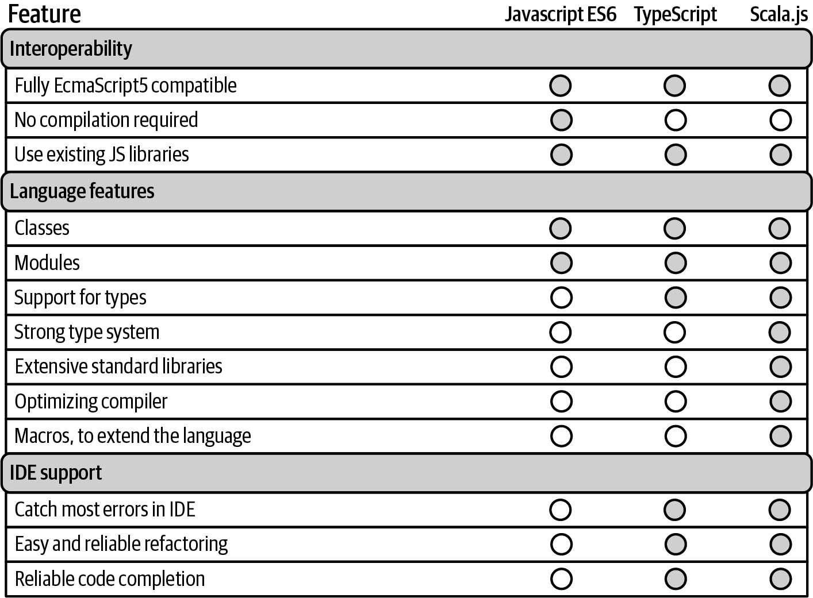

# 21. Scala.js、GraalVM和jpackage

Scala.js项目（ *https://www.scala-js.org* ）作为一个强大的、类型安全的JavaScript的替代品，可以让你编写Scala代码替代JavaScript。简而言之，当你需要编写JavaScript时，可以用Scala.js来代替，并使用sbt和Scala.js插件将Scala.js代码编译成JavaScript。就像 **scalac** 把Scala代码编译成能在 JVM 上运行的 *.class* 文件一样，Scala.js插件把Scala代码编译成能在浏览器上运行的JavaScript代码。

Scala.js网站将Scala.js描述为“以更安全的方式构建强大的前端web应用”。Scala.js有很多优点，比如可以使用类、模块、强大的类型系统、大量的类库，以及IDE对简单重构、代码补全等功能的支持，Scala.js是JavaScript以及CoffeeScript、Dart和TypeScript等其他JavaScript的强有力的替代方案。Scala.js可以使用相同工具来编写服务器端和客户端代码。

图21-1总结了Scala.js与其他浏览器技术相比的优势，该图由Scala.js网站提供，转载于此。

本章包括三个Scala.js示例，以帮助你入门：
- 21.1小节展示了如何建立和运行Scala.js环境。
- 在设置好环境后，21.2小节展示了如何编写Scala/Scala.js代码以响应按钮点击之类的事件。
- 然后，21.3小节展示了如何开始编写单页面的Web应用程序。



*图21-1. Scala.js的优点（由scala-js.org提供）*

接下来，21.4小节展示了GraalVM（ *https://www.graalvm.org* ）和它的 **native-image** 命令。顾名思义，这个命令可以把Scala应用程序变成一个native镜像。通过创建一个本地可执行文件 —— 例如Microsoft Windows上的 *.exe* 文件 —— 应用程序将立即启动，而没有JVM应用程序最初启动时的滞后感。

最后，**jpackage** 命令是Java 14 JDK附带的一个优秀工具。它可以把JVM应用程序打包成macOS、Windows和Linux平台上的native应用程序。**jpackage** 适用于任何为JVM生成 *class* 文件的语言，所以21.5小节展示了如何使用它把Scala应用程序打包成native应用程序。

## 21.1 Scala.js入门

### 问题

你想开始使用Scala.js，需要知道如何安装它并创建一个“Hello, world”的例子。

### 解决方案

本小节展示了如何开始使用Scala.js，并假定你熟悉JavaScript、HTML和文档对象模型（DOM）。

开始使用Scala.js是一个多步骤的过程：
1. 处理好先决条件
2. 创建一个使用Scala.js插件的新sbt项目
3. 创建一个Scala/Scala.js文件
4. 编译并运行Scala代码

#### 1. 先决条件

要开始使用Scala.js，你需要在系统上安装这些工具：
- Scala 3 （ *https://www.scala-lang.org* ）
- sbt （1.5.0更高版本） （ *https://www.scala-sbt.org* ）
- Node.js （ *https://nodejs.org/en/download* ）

在macOS系统上，我用 **brew install node** 命令安装了Node.js，但你也可以按照该链接，用它所提供的安装程序来安装它。

#### 2. 创建一个新sbt项目

创建一个新的sbt项目目录结构，如17.1小节“为sbt创建一个项目目录结构”所示。然后编辑 *build.sbt* 文件，改成下面这些内容：
```scala
    ThisBuild / scalaVersion := "3.0.0"

    // 启用`project/plugins.sbt`中的插件
    enablePlugins(ScalaJSPlugin)

    // 这表明这是一个具有main方法的应用程序
    scalaJSUseMainModuleInitializer := true

    lazy val root = project
      .in(file("."))
      .settings(
        name := "ScalaJs Hello World",
        version := "0.1.0"
      )
```

如果你在电脑上跟读，我强烈建议你使用所显示的确切内容，因为它们会影响Scala代码被编译成JavaScript文件时的文件名。

最后，在 *project/plugins.sbt* 文件中添加这行：
```scala
    addSbtPlugin("org.scala-js" % "sbt-scalajs" % "1.5.1")
```

这句话告诉sbt如何下载Scala.js库。

#### 3. 创建一个Scala/Scala.js文件

设置好sbt后，先创建一个简单的Scala “Hello, world”应用程序。然后，创建一个名为 *src/main/scala/hello/Hello1.scala* 的Scala源代码文件，内容如下：
```scala
    package hello
    @main def hello() = println("Hello, world")
```

这段代码并没有对Scala.js做任何特定的处理，但当你编译并运行它时，你会看到编译过程是如何使用sbt和Scala.js插件。

#### 4. 编译并运行Scala代码

为了运行 *Hello1.scala* 的代码，首先启动sbt shell：
```
    $ sbt
```

现在在sbt shell里面输入 **run** 命令，你可能会看到大量的初始输出，并最终以你程序的输出结束：
```
    sbt> run
    // possibly more output here ...
    [info] compiling 1 Scala source to target/scala-3.0.0/classes ... 
    [info] Fast optimizing target/scala-3.0.0/scalajs-hello-world-fastopt 
    [info] Running hello.hello. Hit any key to interrupt.
    Hello, world
```

示例所示，**Hello, world** 是在Scala代码被编译成JavaScript后打印出来的。之后，正如scala-js.org基本教程（ *https://oreil.ly/gMn7L* ）所指出的，“这段代码实际上是由一个JavaScript解释器，即Node运行的”。

一个需要注意的重要问题是，sbt **run** 命令会创建这个目录：
```scala
    target/scala-3.0.0/scalajs-hello-world-fastopt
```

关于这个目录的一些说明：
- 目录名称是基于sbt项目名称的（"Scala.js Hello World"）。这就是为什么我之前建议你在 *build.sbt* 文件中使用我的项目名称 —— 这样我们产生的目录名称就会是相同的。
- Scala.js的文件命名过程会在该目录名的末尾加上 **-fastopt**。
- 在该目录中，你会发现有两个文件，*main.js* 和 *main.js.map*。
- 如果你用 **cat**、**more** 或其他工具看一下产生的 *target/scala-3.0.0/scalajs-hello-world-fastopt/main.js* 文件，你会发现它包含两千多行一些难以阅读的JavaScript源代码。

在该文件的最后，你会看到一行代码，看起来像这样：
```
    $s_Lhello_hello__main__AT__V(new ($d_T.getArrayOf().constr)([]));
```

虽然很难读懂，但是 **hello** 和 **main** 的引用表明这段代码是由你的Scala **@main**方法产生的。

恭喜你，你刚刚把你的第一段Scala代码编译成了JavaScript。

### 讨论

这是开始使用Scala.js的第一步。当然，如果你希望看到代码在浏览器中运行，只需再做几步就行：
5. 更新 *build.sbt*。
6. 创建一个HTML文件。
7. 更新你的Scala代码。
8. 用 **fastLinkJS** 运行该应用程序。
9. 在浏览器中打开HTML文件。

#### 5. 更新build.sbt

下一步，在 *build.sbt* 文件的末尾添加这一行：
```scala
    libraryDependencies += "org.scala-js" %%% "scalajs-dom" % "1.1.0"
```

这让我们可以在Scala代码中使用Scala.js的DOM库（ *https://oreil.ly/Me2OZ* ），我们一会儿就会这么做。请注意，这个特定的DOM库只是Scala.js（ *https://oreil.ly/RgfqJ* ）的众多JavaScript facade类库中的一个。

如果你还在sbt shell中，重新加载配置文件：
```scala
    sbt> reload
```

#### 6. 创建 hello1.html

接下来，在sbt项目的根目录下创建一个名为 *hello1.html* 的HTML文件，内容如下：
```
    <!DOCTYPE html>
    <html>
      <head>
        <meta charset="UTF-8">
        <title>Scala.js Hello, World</title>
      </head>
      <body>
          <!-- include the Scala.js compiled code -->
          <script type="text/javascript"
                  src="./target/scala-3.0.0/scalajs-hello-world-fastopt.js">
          </script>
      </body>
    </html>
```

注意，**script** 标签中包括了你一会儿要从Scala代码中生成的 *target/scala-3.0.0/scalajs-hello-world-fastopt.js* JavaScript文件。还要注意的是，这个文件名与解决方案中的代码所生成的名字不同。

#### 7. 更新Hello1.scala

现在更新 *Hello1.scala* 文件，使其包含这些内容：
```scala
    package hello

    import org.scalajs.dom
    import dom.document

    @main def hello1() =
        val parNode = document.createElement("p")
        val textNode = document.createTextNode("Hello, world")
        parNode.appendChild(textNode)
        document.body.appendChild(parNode)
```

在解决方案展示的例子中，这个文件包含普通的Scala代码，但现在它使用DOM库来创建代码，这看起来很像JavaScript代码。这段代码创建了一个段落标签，在其中放入了一些文本，然后将段落节点添加到文档的主体中。

#### 8. 使用fastLinkJS编译代码

接下来，从你的Scala源代码文件中生成JavaScript文件。可以用sbt **fastLinkJS** 命令来做这件事：
```
    sbt> fastLinkJS
```

这条命令生成了你刚才在HTML文件中包含的 *target/scala-3.0.0/scalajs-hello-world-fastopt.js* 文件。

#### 显示所生成的文件名 -- TODO 耗子栏

&nbsp;&nbsp;&nbsp;&nbsp;要查看 **fastLinkJS** 生成的文件名，请在 **fastLinkJS** 命令前加上 **show**：
```
    sbt> show fastLinkJS
    [info] target/scala-3.0.0/scalajs-hello-world-fastopt.js
```

#### 9. 在浏览器中打开hello1.html

现在在浏览器中打开该HTML文件。在macOS上，你可以用这个命令从命令行打开它：
```
    $ open hello1.html
```

你也可以用一个文件打开该文件。这个URL取决于你在文件系统中的项目路径。它看起来会像 *file:///Users/al/ScalaJSHelloWorld/hello1.html*。

假设你成功这样做了后，应该可以在浏览器中看到文本“Hello, world”。

#### 玩得开心一点儿

作为奖励，如果你想找点乐子，可以随时用这段代码做实验。我建议把这两行代码放在 *Hello1.scala* 文件中 *@main* 方法的任何地方：
```scala
    println("foo")
    System.err.println("bar")
```

添加完这几行后，再次运行 **fastLinkJS** 命令，重新加载你的网页，并查看你的浏览器控制台，比如说以下步骤：
- Chrome和Firefox：右键单击 → 检查 → 控制台

在浏览器控制台中，你应该看到 *foo* 以正常颜色打印，而 *bar* 以红色打印。这是一个帮助调试Scala.js应用程序的简单方法。

### 另见

- Scala.js主页（ *https://www.scala-js.org* ）。
- 这个初始示例在很大程度上是基于Scala.js的基础教程（ *https://oreil.ly/LFT0E* ）。

## 21.2 使用Scala.js响应事件

### 问题

你想知道如何使用Scala.js来响应事件，比如处理一个按钮点击事件。

### 解决方案

我在之前的示例中，展示了如何设置Scala.js的工作环境。本解决方案以该示例为基础，展示了如何使用Scala/Scala.js代码来响应HTML按钮的点击事件。

这是一个多步骤的解决方案，它建立在上一个示例中创建的sbt项目之上：
1. 创建一个新的HTML页面。
2. 更新sbt以支持使用jQuery。
3. 编写新的Scala/Scala.js代码。
4. 在sbt中设置 **main** class。
5. 运行代码。

这些步骤将在下面的小节中展示。

#### 1. 创建一个新的HTML页面

假设你正在使用21.1小节中创建的sbt项目，第一步是创建一个新的HTML网页。把这个文件命名为 *hello2.html*，并把它放在项目的根目录下，其内容如下：
```
    <!DOCTYPE html>
    <html>
    <head>
        <meta charset="UTF-8">
        <title>Scala.js, Hello World 2</title>
    </head>
    <body>
        <button type="button" id="hello-button">
            Click me!
        </button>
      
        <!-- the 'jsdeps' file must be first -->
        <script type="text/javascript"
                src="./target/scala-3.0.0/scalajs2-jsdeps.js"></script>
        <script type="text/javascript"
                src="./target/scala-3.0.0/scalajs2-fastopt.js"></script>
    </body>
    </html>
```

与前面示例中的HTML文件相比，这个文件的重要变化是：
- 本页有一个 __\<button\>__ 元素。
- 这个页面包括一个名为 *scalajs2-jsdeps.js* 的新文件。正如jsdeps这个名字所暗示的，这个文件包含了我们代码的依赖项，特别是 *scalajs2-fastopt.js* 所依赖的依赖项。稍后你会了解关于这些依赖的更多信息。
- 我们的Scala/Scala.js代码生成的新文件被命名为 *scalajs2-fastopt.js*。正如前面示例中所提到的，这个名字是基于 *build.sbt* 中所指定的项目名称。

#### 2. 更新sbt以支持使用jQuery

要更新我们的sbt配置，首先要更新 *project/plugins.sbt* 文件，使其具有这些内容：
```
    addSbtPlugin("org.scala-js" % "sbt-scalajs" % "1.5.1")
    // for adding webjars
    
    addSbtPlugin("org.scala-js" % "sbt-jsdependencies" % "1.0.1")
```

第一行是在上一个示例中使用的，它将Scala.js sbt插件添加到项目中。最后一行是这个示例的新配置，它是能让我们在代码中使用WebJars库的第一步。(稍后会有更多关于这个的内容）。

接下来，从Scala.js代码中处理HTML按钮点击的最简单方法是与Scala.js一起使用Scala.js jQuery facade库。有多个facade库可选用，如果要在这个项目中使用名为jquery-facade（ *https://oreil.ly/PH6ty* ）的库，请在 *build.sbt* 文件的 **libraryDependencies** 中添加这一行：
```
    ("org.querki" %%% "jquery-facade" % "2.0").cross(CrossVersion.for3Use2_13)
```

（稍后你将看到完整的 *build.sbt* 文件）。

jquery-facade库是用Scala编写的，在 *build.sbt* 文件中加入这一行，就可以把它作为这个项目的依赖项。关于这行的重点是，**cross(CrossVersion.for3Use2_13)** 设置是让你在Scala 3项目中使用Scala 2.13库的神奇魔法。

接下来，还需要在HTML文件中加入实际的jQuery库 —— 用JavaScript编写的。你可以在HTML文件中加入一行这样的代码：
```
    <script src="https://ajax.googleapis.com/ajax/libs/jquery/2.2.1/jquery.min.js">
    </script>
```

但是，sbt给你提供了另一种方式来将jQuery的JavaScript库引入到项目。在 *build.sbt* 文件中添加下面一行代码以使用sbt的方式：
```scala
    jsDependencies += "org.webjars" % "jquery" % "2.2.1" / "jquery.js" minified ↵
                      "jquery.min.js"
```

这一行让你在项目中使用WebJars（ *https://www.webjars.org* ）的“被打包为JAR文件的客户端web库”。它特意引入了2.2.1版本的jQuery JavaScript库（ *https://jquery.com* ）—— 真正的JavaScript库，而不是Scala facade —— 然后当你在sbt中执行 **fastLinkJS** 命令时，这些JavaScript代码就被写入本地的 *target/scala-3.0.0/scalajs2-jsdeps.js* 文件。这一步不是必须的 —— 如前所示，你可以使用 **<script>** 标签引入jQuery —— 但这展示了一种将JavaScript库/依赖项添加到Scala.js/sbt项目的可能方式。

此时，*hello2.html* 文件中的这两行便容易理解了：
```scala
    <!-- the 'jsdeps' file must be first -->
    <script type="text/javascript"
            src="./target/scala-3.0.0/scalajs2-jsdeps.js"></script>
    <script type="text/javascript"
            src="./target/scala-3.0.0/scalajs2-fastopt.js"></script>
```

第一行将我们的JavaScript依赖关系导入到HTML文件（这里是指jQuery），第二行包含你在 *src/main/scala/hello/Hello2.scala* 中编写的自定义Scala/Scala.js代码所生成的JavaScript。

最后，因为你要写的Scala代码依赖于jQuery，HTML文件中首先需要导入jsdeps。

#### 3. 编写新的Scala/Scala.js代码

现在你已经有了新的HTML文件，并且jQuery已经准备好在项目中使用，剩下的主要事情就是写一些Scala/Scala.js代码来响应 **\<button\>** 的点击。在这样做之前，需要注意的是 *hello2.html* 中的 **\<button\>** 的 **id** 是 **hello-button**：
```scala
    <button type="button" id="hello-button">
                              ------------
```

你会在接下来的Scala代码中使用到这个 **id** 。

用jQuery facade库响应按钮点击并显示一个JavaScript窗口的Scala代码出奇的简单。将这段代码保存在一个名为 *src/main/scala/hello/Hello2.scala* 的文件中：
```scala
    import org.scalajs.dom
    import org.querki.jquery.*

    @main def hello2 =
        // handle the login button click
        $("#hello-button").click{ () =>
            dom.window.alert("Hello, world")
        }
```

如果你以前使用过jQuery，这段代码看起来会很熟悉。它可以被解读为：“找到 **id** 值为 **hello-button** 的HTML元素，当它被点击时，运行这个小算法，显示一个JavaScript提示窗口，内容为 **Hello, world**。” 这太好了，因为你可以在Scala代码中使用 **$** 符号，这与在JavaScript中使用jQuery是一致的。

#### 4. 在sbt中设置main class

在运行这个例子之前，你还需要做一件事：更新 *build.sbt* 文件，以考虑到项目中现在有两个 **main** 方法 —— 21.1小节中的 *Hello1.scala* 和 *Hello2.scala* 中的另一个。要做到这一点，在 *build.sbt* 文件中添加这行，就在 **scalaJSUseMainModuleInitializer** 设置的下面：
```scala
    Compile/mainClass := Some("hello.Hello2")
```

有了这个示例中所展示的变化，完整的 *build.sbt* 文件现在应该有这些内容：
```scala
    ThisBuild / scalaVersion := "3.0.0"

    // 启用`project/plugins.sbt`中的插件
    enablePlugins(ScalaJSPlugin)

    // 这说明这是一个有main方法的应用程序
    scalaJSUseMainModuleInitializer := true
    Compile/mainClass := Some("hello.Hello2")

    lazy val root = project
      .in(file("."))
      .settings(
          name := "ScalaJs2",
          version := "0.1",
          libraryDependencies ++= Seq(
              ("org.scala-js" %%% "scalajs-dom" % "1.1.0")
                  .cross(CrossVersion.for3Use2_13),
              ("org.querki" %%% "jquery-facade" % "2.0")
                  .cross(CrossVersion.for3Use2_13)
          ), 
      )
      // this includes jquery with webjars.
      // see: https://github.com/scala-js/jsdependencies
      enablePlugins(JSDependenciesPlugin)
      jsDependencies += "org.webjars" % "jquery" % "2.2.1" / "jquery.js" ↵
                        minified "jquery.min.js"
```

关于这个文件的其他说明：
- **enablePlugins(ScalaJSPlugin)** 一行是在一个sbt项目中使用Scala.js的示例的一部分。
- **scalaJSUseMainModuleInitializer** 表明这是一个有 **main** 方法的应用程序。
- **Compile/mainClass** 设置用来声明构建的 **main** 方法是 *hello.Hello2*（ **hello** 包中 **Hello2** 类的main方法）。
- 把项目名称改为“**ScalaJs2**”。

#### 5. 运行代码

### 讨论

### 另见

## 21.3 使用Scala.js构建单页面的应用程序

### 问题

### 解决方案

### 讨论

### 另见

## 21.4 使用GraalVM构建本地可执行文件

### 问题

### 解决方案

### 讨论

### 另见

## 21.5 使用jpackage打包应用程序

### 问题

### 解决方案

### 讨论

### 另见