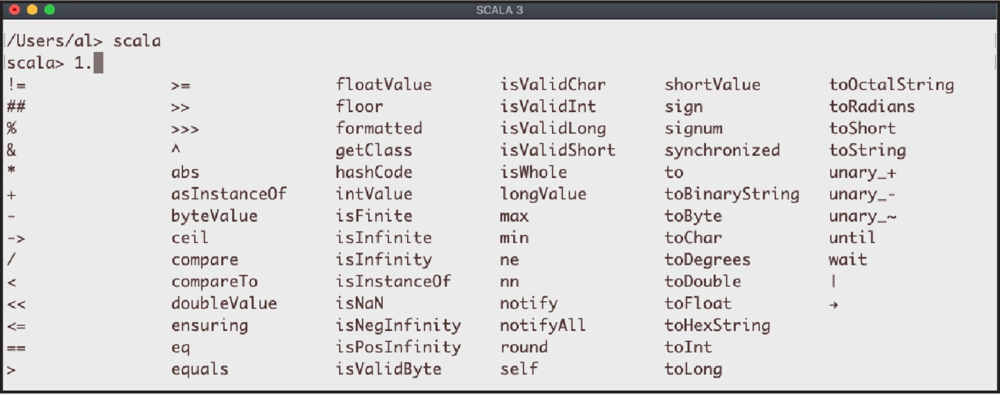

# 22. Scala与Java集成

本书完成于2021年，因此本章主要介绍Scala 3和Java 11的集成，后者是Oracle目前的长期支持版本。Java版本的要点在于，目前Oracle每年都有两个主要的Java版本发布计划。

一般来说，Scala和Java代码是可以无缝混合的。在大多数情况下，可以创建一个sbt项目，把Scala代码放在 *src/main/scala* 中，把Java代码放在 *src/main/java* 中，就可以正常工作了。

本章中的小节涵盖了转换器、特质和接口、异常、数字类型的转换等问题。

在作者与Scala/Java的集成的经验中，遇到的最大问题是它们的集合库之间的差异。然而，总是能够通过Scala的 **CollectionConverters** 对象来解决这些问题。从Scala 2.13开始，现在有两个 **CollectionConverters**对象：

- Scala代码中使用的扩展方法在 **scala.jdk.Collection Converters** 中。
- Java代码的转换方法在 **scala.jdk.javaapi.Collection Converters** 中。

同样地，这些转换对象也会处理Scala的 Option 和Java的 Optional 之间的转换：

- Scala的扩展方法在 **scala.jdk.OptionConverters** 中。
- Java的转换方法在 **scala.jdk.javaapi.OptionConverters** 中。

这些转换方法在本章的初始小节中展示。

在转换相关的小节之后，小节 22.5和22.6深入探讨了Scala 特质和Java接口之间的关系。由于Java 8或更高版本中接口的特性，traits和接口比 *Scala Cookbook* 第一版中更加紧密地结合在一起。

Scala和Java之间的其他方面集成需要使用注解，这些在关于异常（ **@throws** ）、varargs参数（ **@varargs** ）和序列化（ **@SerialVersionUID** ）的小节中都有涉及。

最后，如果对Java很熟悉，但对Scala很陌生，那么有必要提一下，Scala中的所有东西都是一个对象。具体来说就是意味着Scala没有原始的数字数据类型。如图22-1所示，在Scala REPL中输入数字1，然后输入小数点，再按Tab键，REPL就会显示 **Int** 实例上的所有方法。



*图 22-1 在Scala中，所有东西都是一个对象，即使整数也是。*

## 22.1 在Scala中使用Java集合对象

### 问题

在Scala应用程序中使用Java类，而这些类要么返回Java集合，要么在其方法调用中需要Java集合，需要将这些与Scala集合的使用结合起来。

### 解决方案

在Scala代码中使用 **scala.jdk.CollectionConverters** 对象的扩展方法来实现转换。例如，如果在一个名为 **JavaCollections** 的公有Java类中有一个这样的 **getNumbers** 的方法：

```
    // java 
    public static List<Integer> getNumbers() {
        return new ArrayList<Integer>(List.of(1,2,3));
    }
```

可以在Scala代码中把这个Java列表转换成Scala **Seq**，如下：

```
    // scala 
    import scala.jdk.CollectionConverters.* 
    import java.util.List

    def testList =
        println("Using a Java List in Scala") 
        val jlist: java.util.List[Integer] = JavaCollections.getNumbers 
        // jlist.getClass is "class java.util.ArrayList"

        // note that this is `Seq[Integer]` and not `Seq[Int]`: 
        val slist: Seq[Integer] = jlist.asScala.toSeq 
        slist.foreach(println)
```

同样地，如果有一个Java方法，返回一个 **Map** ：

```
    // java 
    public static Map<String, String> getPeeps() { 
        return new HashMap<String, String>(Map.of( 
            "Captain", "Kirk", 
            "Mr.", "Spock" 
        )); 
    }
```

可以像这样将其转换为Scala **Map** ：

```
    // scala 
    import scala.jdk.CollectionConverters.* 
    import java.util.{Map => JavaMap} 
    import scala.collection.mutable.{Map => ScalaMap}
    
    @main def testMap =
        println("use a Java Map in Scala") 
        val jmap: JavaMap[String,String] = JavaCollections.getPeeps 
        val smap: ScalaMap[String,String] = jmap.asScala 
        for (k,v) <- smap do println(s"key: '$k', value: '$v'")
```

同样地，这个例子展示了如何将Java **Properties** 对象转换为Scala **Map** 。

```
    // [1] create and populate a Java Properties object 
    val javaProps = new java.util.Properties 
    javaProps.put("first_name", "Charles") 
    javaProps.put("last_name", "Carmichael")
    
    // [2] convert Java Properties to Scala Map 
    import scala.jdk.CollectionConverters.* 
    val scalaProps = javaProps.asScala println(scalaProps)
```

println语句会打印出这样的输出：

```
    Map(last_name -> Carmichael, first_name -> Charles)
```

### 讨论

本小节展示了如何在Scala中进行集合转换。要在Java代码中进行转换，请看下一个小节。

#### 类型转换

解决方案中的第一个例子展示了如何从 **Java.util.List\<Integer\>** 创建一个Scala **Seq[Integer]** ：

```
    val slist: Seq[Integer] = jlist.asScala.toSeq
```

假设确认想要一个 **Seq[Int]** ——而不是 **Seq[Integer]** ——那么代码中需要添加一个 **Integer** 到 **Int** 的转换过程。

```
    def integer2Int(i: Integer): Int = i

    val jlist2: java.util.List[Integer] = MyJavaClass.getNumbers() 
    val slist2: Seq[Int] = jlist2.asScala.map(i => integer2Int(i)).toSeq
```

这段代码的作用如下：

- 创建一个 **jlist2** 其类型为 **java.util.List[Integer]** 。
- 使用 **asScala** 将该代码转换为Scala的 **Buffer[Integer]** 。
- 用 **map** 方法和 **integer2Int** 函数将 **Buffer[Integer]** 转换为 **Buffer[Int]** 。
- 通过调用 **toSeq** 创建最终的 **Seq[Int]** 。

#### 转换方法

像这样的代码之所以能够工作，是因为 **CollectionConverters** 对象中的转换方法。表22-1列出了使用 **asScala** 和 **asJava** 方法所能进行的双向转换：

*表22-1，**scala.jdk.CollectionConverters** 对象所提供的双向转换功能*

| Scala 集合                      | Java 集合                          |
| ------------------------------- | ---------------------------------- |
| scala.collection.Iterable       | java.lang.Iterable                 |
| scala.collection.Iterator       | java.util.Iterator                 |
| scala.collection.mutable.Buffer | java.util.List                     |
| scala.collection.mutable.Set    | java.util.Set                      |
| scala.collection.mutable.Map    | java.util.Map                      |
| scala.collection.concurrent.Map | java.util.concurrent.ConcurrentMap |

例如，可以使用 **asJava** 将Scala **Buffer** 转换为Java **List** ，也可以使用 **asScala** 进行相反的转换。

表22-2显示了额外的双向转换。 **asScala** 支持向Scala的转换，括号中提供的特别命名的扩展方法则可把Scala集合转换为Java集合。

*表22-2 额外的双向转换，包括特别命名的方法*

| Scala 集合                   | Java 集合                                      |
| ---------------------------- | ---------------------------------------------- |
| scala.collection.Iterable    | java.util.Collection (通过 asJavaCollection)   |
| scala.collection.Iterator    | java.util.Enumeration (通过 asJavaEnumeration) |
| scala.collection.mutable.Map | java.util.Dictionary (通过 asJavaDictionary)   |

表22-3 列出了用 **asJava** 可以实现的单向转换。

*表22-3 **CollectionConverters** 类提供的从Scala 到 Java的单向转换*

| Scala集合                    | Java集合       |
| ---------------------------- | -------------- |
| scala.collection.Seq         | java.util.List |
| scala.collection.mutable.Seq | java.util.List |
| scala.collection.Set         | java.util.Set  |
| scala.collection.Map         | java.util.Map  |

表22-4 列出了用 **asScala** 可以实现的单向转换。

*表22-4 **asScala** 提供的单向转换*

| Scala集合            | Java 集合                                  |
| -------------------- | ------------------------------------------ |
| java.util.Properties | scala.collection.mutable.Map[String,String |

### 另见

- scala.jdk.CollectionConverters 提供从 Java 到 Scala 的转换
- scala.javaapi.CollectionConverters 提供从 Scala 到 Java 的转换
- scala.jdk.javaapi.StreamConverters 用于创建可以与 Scala 一起工作的 Java 流

## 22.2 在Java中使用Scala集合

### 问题

需要在Java应用程序中访问Scala集合类，并将这些Scala类转换为Java类。

### 解决方案

在Java代码中，使用Scala的 **scala.javaapi.CollectionConverters** 对象的方法来实现转换的工作。例如，如果在Scala类中有一个像这样的 **List[String]** ：

```
    // scala 
    class ScalaClass:
        val strings = List("a", "b")
```

可以像这样在Java代码中访问Scala的 **List** ：

```
    // java 
    import scala.jdk.javaapi.CollectionConverters;
    
    ScalaClass sc = new ScalaClass();
    
    // access the `strings` field as `sc.strings()`
    scala.collection.immutable.List<String> xs = sc.strings();
    
    // create a Java List<String>
    java.util.List<String> listOfStrings = CollectionConverters.asJava(xs);
```

关于这段代码，有几点需要注意：

- 在Java代码中，创建一个 **ScalaClass** 的实例，就像创建一个Java类的实例一样。
- **ScalaClass** 有一个名为 **strings** 的字段，但在Java中，必须以方法的形式访问这个字段的，比如说， **sc.strings()** 。

这里把这段代码写得很长，是为了帮助强调这些要点，也可以像这样一步到位地进行转换：

```
    java.util.List<String> listOfStrings2 = CollectionConverters.asJava(
        (new ScalaClass()).strings()
    );
```

### 讨论

本小节展示了如何在Java中进行集合转换。要在Scala代码中进行转换，请参见前面的小节。

在某些情况下，会遇到类型擦除的问题。例如，鉴于Scala类中的这个ints字段：

```
    class ScalaClass:
        val ints = Seq(1,2,3)
```

必须将Scala **Seq** 作为Java中的 **List\<Object\>** 来访问：

```
    // java 
    ScalaClass sc = new ScalaClass();
    java.util.List<Object> listInt = CollectionConverters.asJava(sc.ints());
    
    // this also works 
    java.util.List listInt = CollectionConverters.asJava(sc.ints());
```

当用 **scalac** 编译Scala类，然后用 **javap** 反汇编时，就可以看到类型擦除的问题，会看到这样的代码：

``` 
    public scala.collection.immutable.Seq<java.lang.Object> ints();
```

如图所示，该类文件只知道有一个 **ints()** 方法返回 **Seq<java.lang.Object>** 。

如果读者接触过Scala的源代码，就知道可以先将 **Seq[Int]** 转换为 **Seq[Integer]** ，从而使其更容易从Java中访问：

```
    // in a scala class 
    val jIntegers: Seq[java.lang.Integer] = Seq(1,2,3).map(i => i:java.lang.Integer)
```

现在可以像这样在一个Java类中以 **List\<Integer\>** 的形式访问它：

```
    // java
    java.util.List<Integer> listIntegers =
        CollectionConverters.asJava(sc.jIntegers());
```

如果不能修改Scala代码，可能要进行其他与强制类型转换有关的工作来处理 **java.util.List\<Object\>** ，这取决于实际需求

### 另见

**scala.jdk.javaapi.CollectionConverters** 对象所支持的双向转换与前面的小节中所示的 **scala.jdk.CollectionConverters** 对象相同。关于这些转换，请参见前面的小节，更多细节请参见这些链接：

- scala.jdk.CollectionConverters 提供从 Java 到 Scala 的转换
- scala.javaapi.CollectionConverters 提供从 Scala 到 Java 的转换
- scala.jdk.javaapi.StreamConverters 用于创建可以与 Scala 一起工作的 Java 流

## 22.3 在Scala中使用Java的Optional值

### 问题

如何在Scala代码中使用Java的 **Optional** 值

### 解决方案

在写Scala代码时，导入 **scala.jdk.OptionConverters** 对象，然后使用扩展方法 **toScala** 将Java **Optional** 值转换为Scala **Option** 。

为了证明这一点，在这里会创建一个有两个 **Optional\<String\>** 值的Java类，一个包含一个字符串，另一个则为空：

```
    // java 
    import java.util.Optional;
    
    public class JavaClass {
        static Optional<String> oString = Optional.of("foo");
        static Optional<String> oEmptyString = Optional.empty();
    }
```

然后在下面的Scala代码中，可以访问这些字段。如果直接访问它们，它们都将是 **Optional** 值：

```
    // scala 
    import java.util.Optional
    
    val optionalString = JavaClass.oString         // Optional[foo]
    val eOptionalString = JavaClass.oEmptyString   // Optional.empty
```

但是通过使用 **scala.jdk.OptionConverters** 方法，可以将其转换成Scala的 **Option** 值：

```
    import java.util.Optional 
    import scala.jdk.OptionConverters.*
    
    val optionalString = JavaClass.oString 
    val optionString = optionalString.toScala
    
    val eOptionalString = JavaClass.oEmptyString 
    val eOptionString = eOptionalString.toScala
```

这种语法之所以有效，是因为 **toScala** 被定义为一个扩展方法，所以可以在Optional实例上调用。

#### 数字值

数字值从Java到Scala的转换也很好实现。假设有以下Java代码：

```
    // java 
    import java.util.Optional; 
    import java.util.OptionalInt;
    
    public class JOptionalNumericToScala {
        static Optional<Integer> oInt = Optional.of(1);
        static Optional<Integer> oEmptyInt = Optional.empty();
        static OptionalInt optionalInt = OptionalInt.of(1);
    }
```

可以在Scala代码中使用如前所述的这些类型为 **Optional\<Integer\>** 或 **OptionalInt** 的字段。

```
    // scala 
    import java.util.Optional
    
    // Optional[Int] 
    val optionalInt = JOptionalNumericToScala.oInt           // Optional[1]
    val optionInt = optionalInt.toScala                      // Some(1)

    // Optional[Int] (empty) 
    val eOptionalInt = JOptionalNumericToScala.oEmptyInt     // Optional.empty
    val eOptionInt = eOptionalInt.toScala                    // None

    // OptionalInt 
    val optionalInt2 = JOptionalNumericToScala.optionalInt   // OptionalInt[1]
    val sOptionalInt2 = optionalInt2.toScala                 // Some(1)
```

### 讨论

在整合时如果能修改Java侧源码，也可以使用 **scala.jdk.javaapi.OptionConverters** 中的转换方法，在Java代码中而不是在Scala代码中把 **Optional** 值转换成 **Option** 值。注意这个对象也被命名为 **OptionConverters** ，但这两个对象是在不同的地方用来转换 **Optional** 值的。

- 在Scala代码中使用 **scala.jdk.OptionConverters**
- 在Java代码中使用 **scala.jdk.javaapi.OptionConverters**

#### 在Java中将Optional转换为Option

下面这个例子展示了如何使用 **scala.jdk.javaapi.OptionConverters** 对象的方法，在Java代码中把 **Optional** 字段转换为 **Option** 值。

```
    // java 
    import java.util.Optional; 
    import java.util.OptionalInt; 
    import scala.jdk.javaapi.OptionConverters; 
    import scala.Option;
    
    public class JOptionalNumericToScala { 
        static Option<Integer> oInt1 = OptionConverters.toScala(Optional.of(1)); 
        static Option<Integer> oInt2 = OptionConverters.toScala(OptionalInt.of(2)); 
    }
```

注意第一个例子使用了 **Optional** ，第二个例子使用了 **OptionalInt** ，两者都转换为了Scala **Option** 。当它们在Java代码中被这样转换后，在Scala代码中就会显示为 **Option** 值：

```
    // scala 
    val oInt1 = JOptionalNumericToScala.oInt1   // Some(1)
    val oInt2 = JOptionalNumericToScala.oInt2   // Some(2)
```

### 另见

用于转换 **Optional** 和 **Option** 值的两个Scala对象是：

- 在Scala代码中使用scala.jdk.OptionConverters
- 在Java代码中使用scala.jdk.javaapi.OptionConverters

## 22.4 在Java中使用Scala的Option值

### 问题

如何在Java代码中使用Scala的 **Option** 值。

### 解决方案

可以在Scala代码中或在Java代码中把一个Scala **Option** 值转换成一个Java **Optional** 值。这里展示的是在Scala中的解决方案，而在Java中的解决方案则在讨论中展示。

在Scala代码中，在导入 **scala.jdk.OptionConverters** 后，使用 **toJava** 扩展方法将Scala **Option** 转换为 Java **Optional** 值。

为了证明这一点，这里创建有两个 **Option[String]** 值的Scala类，一个包含一个字符串，另一个是空的，使用 **toJava** 将这些 **Option[String]** 值转换成 **java.util.Optional[String]** ：

```
    // scala 
    import scala.jdk.OptionConverters.*
    
    // create java.util.Optional[String] values
    object Scala:
        // convert a Some to Optional
        val scalaStringSome = Option("foo").toJava
        // convert a None to Optional
        val scalaStringNone = Option.empty[String].toJava
```

然后在Java代码中，直接以 **Optional** 为类型访问这些字段：

```
    // java 
    import java.util.Optional;
    
    Optional<String> stringSome = Scala.scalaStringSome(); // Optional[foo]
    Optional<String> stringNone = Scala.scalaStringNone(); // Optional.empty
```

这两个字段可以作为 **Optional** 值使用，在Java代码中看到的唯一区别是Scala字段（如 **scalaStringSome** ）在Java代码中作为方法出现，而不是作为字段来使用。

#### 含有数字值的 Option

转换被Scala 数字值的 **Option** 可能要多花点功夫，但它们也还是可以被转换为Java **Optional** 值。**scala.jdk.Option.Converters** 对象为这些情况提供了几种方法。例如，给定这样Scala代码，它创建了 **Optional** 和 **OptionalInt** 值：

```
    // scala 
    import scala.jdk.OptionConverters.*
    
    object Scala:
        val intOptional1 = Option(1).toJava            // Optional[Int], or
                                                       // Optional[Object]
        val optionalInt = Option(1).toJavaPrimitive    // OptionalInt
        val optionalInt2 = optionalInt.toJavaGeneric   // Optional[Int]
```

这些字段可以像这样在Java代码中被访问：

```
    // java 
    import java.util.Optional;
    import java.util.OptionalInt;
    
    Optional intOptional1 = Scala.intOptional1();    // Optional[1]
    OptionalInt optionalInt = Scala.optionalInt();   // OptionalInt[1]
    Optional optionalInt2 = Scala.optionalInt2();    // Optional[1]
```

这个解决方案的关键是，Java代码中的 **Optional** 字段需要以下面这些方式之一来声明：

```
    Optional x = ... 
    Optional<Object> x = ...
    OptionalInt x = ...
```

由于类型擦除，试图像这样声明字段类型将导致编译时错误：

```
    Optional<Integer> intOptional1 = ... // error
```

### 讨论

如果在Java这一侧来做转换，而Scala代码只提供给一个 **Option** 值，可以在Java代码中将其转换成 **Optional** 值。只要使用 **scala.jdk.javaapi.OptionConverters** 对象中的 **toJava*** 方法即可。

#### 同样的名字，不同的包 -- todo （鸟图）

请注意，虽然这个对象与解决方案中显示的对象（ **OptionConverters** ）有相同的名字，但它们在不同的包中，而且这个对象是要在Java代码中使用。

为了演示在Java中把一个 **Option** 转换为一个 **Optional** 值，首先在Scala代码中创建一个 **Option[String]** ：

```
    // scala 
    object Scala:
        val optionString = Option("foo")
```

现在可以在Java代码中使用 **OptionConverters** 的 **toJava** 方法将其转换为 **Optional\<String\>** ：

```
    // java 
    import scala.jdk.javaapi.OptionConverters.toJava;
    Optional<String> stringOptional = toJava(Scala.optionString());
```

除了 **toJava** 之外，可以在Java代码中使用的其他转换方法是：

- **toJavaOptionalDouble** 
- **toJavaOptionalInt**
- **toJavaOptionalLong** 

### 另见

用于转换 **Optional** 和 **Option** 值的两个Scala对象是：

- 在Scala代码中使用scala.jdk.OptionConverters
- 在Java代码中使用scala.jdk.javaapi.OptionConverters

## 22.5 在Java中使用Scala的特质

### 问题

如何在Java侧使用Scala中已经实现了的特质

### 解决方案

本书是用Java 11测试的，在Java 11中，可以像使用Java接口一样使用Scala 特质，即使该特质已经实现。例如，给定这两个Scala 特质，一个已经实现，一个只有接口：

```
    // scala trait 
    SAddTrait:
        def sum(x: Int, y: Int) = x + y    // implemented
        
    trait SMultiplyTrait:
        def multiply(x: Int, y: Int): Int  // abstract
```

一个Java类可以同时实现这两个接口，并实现 **multiply** 方法：

```
    // java 
    class JMath implements SAddTrait, SMultiplyTrait {
        public int multiply(int a, int b) {
            return a * b;
        } 
    }
    JMath jm = new JMath();
    System.out.println(jm.sum(3,4));        //7
    System.out.println(jm.multiply(3,4));   //12
```

### 讨论

这个解决方案过去需要将Scala 特质包装在一个类中，以便Java应用程序可以使用它，但现在的解决方案是使用Scala trait，就像它是一个Java接口一样。

## 22.6 在Scala中使用Java的接口

### 问题

如何在Scala中实现Java的接口

### 解决方案

在Scala应用程序中，使用 **extends** 关键字和逗号来实现Java的接口，就像实现Scala 特质一样。

例如，给定以下三个Java接口：

```
    // java 
    interface Animal { 
        void speak(); 
    }
    
    interface Wagging { 
        void wag(); 
    }
    
    interface Running { 
        // an implemented method 
        default void run() { 
            System.out.println("I’m running"); 
        } 
    }
```

可以用平时使用的 **extends** 关键字来实现特质一样在Scala中创建一个 **Dog** 类并实现 **speak** 和 **wag** 方法：

```
    // scala 
    class Dog extends Animal, Wagging, Running:
        def speak() = println("Woof")
        def wag() = println("Tail is wagging")
```

### 讨论

请注意，Java **Running** 接口声明了一个名为 **run** 的默认方法。如下所示，在Scala中可以很容易使用Java接口中的默认方法。

同样，Java接口中的静态方法在Scala中也可以轻松使用：

```
    // java 
    interface Mathy {
        static int add(int a, int b) {
            return a + b;
        } 
    }
    
    // scala 
    println(Mathy.add(1,1))    // prints "2"
```

## 22.7 为Scala方法添加异常注解

### 问题

如何让Java代码知道一个Scala方法可以抛出一个或多个异常，便于用 **try/catch** 块来处理这些异常。

### 解决方案

Scala方法中添加 **@throws** 注解，这样Java侧的使用者就会知道这些方法会抛出哪些异常。

例如，这个Scala的 **exceptionThrower** 方法被注解为声明它抛出了一个 **Exception** ：

```
    // scala
    object SExceptionThrower:
        @throws(classOf[Exception])
        def exceptionThrower = throw new Exception("Exception from Scala!")
```

结果是，这里的Java代码无法编译，因为没有处理这个异常：

```
    // java: won’t compile
    public class ScalaExceptionsInJava {
        public static void main(String[] args) {
            SExceptionThrower.exceptionThrower();
        } 
    }
```

编译器给出了这样的错误：

```
    [error] ScalaExceptionsInJava: unreported exception java.lang.Exception; 
        must be caught or declared to be thrown 
    [error] SExceptionThrower.exceptionThrower()
```

这就是这段代码想要的实现的：这个注解告诉Java编译器 **exceptionThrower** 可以抛出一个异常。现在当写Java代码时，必须用一个 **try** 代码块来处理这个异常，或者声明Java方法抛出了一个异常：

```
    public static void main(String[] args) throws Exception ...
                                           ----------------
```

相反，如果不对Scala的 **exceptionThrower** 方法进行注解，Java代码就会被成功编译。这可能不是想要的，因为Java代码可能没有考虑到Scala方法抛出的异常。

### 讨论

要声明一个Scala方法可以抛出多个异常，可以在声明方法之前使用多个 **throws** 注解：

```
    // scala 
    @throws(classOf[FooException]) 
    @throws(classOf[BarException])
    def baz() = ...
```

然后在Java代码中，像往常一样捕获这些异常：

```
    try { 
        baz(); 
    } catch(FooException e) {
        // handle the exception 
    } catch(BarException e) {
        // handle the exception 
    } finally {
        // code here as needed 
    }
```

### 另见

虽然这个小节展示了如何注释抛出异常的方法，以便与Java一起工作，但 "Scala方式 "是方法永远不应该抛出异常。参见10.8小节，"实现函数式错误处理"，以了解处理可能的错误的首选方法的细节。

## 22.8 给方法添加varargs注解让其能够被Java代码使用

### 问题

如何从Java代码中调用一个带有varargs字段的Scala方法。

### 解决方案

用 **@varargs** 注解来标记Scala方法。例如，这个Scala类中的 **printAll** 方法声明了一个varargs字段—— **String***，并且用 **@varargs** 将其标记：

```
    // scala 
    import annotation.varargs
    
    object VarargsPrinter:
        @varargs def printAll(args: String*): Unit = args.foreach(println)
```

因为 **printAll** 是用 **@varargs** 注解声明的，所以它可以在Java程序中调用并接受可变参数，如本例中所示：

```
    // java 
    public class JVarargs {
        public static void main(String[] args) {
            VarargsPrinter.printAll("Hello", "world");
        }
    }
```

当这段代码运行时，它的输出结果如下：

```
    Hello
    world
```

### 讨论

如果在 **printAll** 方法上没有使用 **@varargs** 注解，所示的Java代码甚至不会通过编译，会出现以下编译器错误：

```
    [error] JVarargs.java: method printAll in class VarargsPrinter cannot be
        applied to given types; 
    [error] required: scala.collection.immutable.Seq<java.lang.String> 
    [error] found: java.lang.String,java.lang.String 
    [error] reason: actual and formal argument lists differ in length 
    [error] VarargsPrinter.printAll
```

从Java代码这一侧来看，如果没有 **@varargs** 注解， **printAll** 方法是以 **scala.collection.immutable.Seq<java.lang.String>** 作为其参数。

#### 调用Java的varargs方法

从Scala中调用一个Java的varargs方法，一般都能正常使用。例如，这个Java方法：

```
    // java 
    public class JVarargs { 
        // a java method with a varargs parameter 
        static void jPrintAll(String... args) { 
            for (String s: args) { 
                System.out.println(s); 
            } 
        } 
    }
```

可以在下面的Scala代码中调用，并且如预期的那样工作：

```
    // scala 
    @main def jVarargs =
        JVarargs.jPrintAll() 
        JVarargs.jPrintAll("foo") 
        JVarargs.jPrintAll("foo", "bar")
```

## 22.9 使用@SerialVersionUID和其他注解

### 问题

如何将一个Scala类设置为可序列化的，并设置serialVersionUID。

### 解决方案

使用Scala **@SerialVersionUID** 注解，同时也让类扩展 **Serializable** 类型：

```
    @SerialVersionUID(123L) 
    class Sheep(val name: String) extends Serializable:
        override def toString = name
        @transient val greet: String = s"Hello, $name"
```

对于上面这个类写一个 **deepClone** 这样的函数：

```
    // this code ignores possible exceptions 
    def deepClone(obj: Object): Object =
        import java.io.* 
        val baos = ByteArrayOutputStream() 
        val oos = ObjectOutputStream(baos) 
        oos.writeObject(obj) 
        val bais = ByteArrayInputStream(baos.toByteArray()) 
        val ois = ObjectInputStream(bais) 
        ois.readObject()
```

可以这样复制一个 **Sheep** ：

```
    // the original sheep
    val d = Sheep("Dotty")
    println(d)       // Dotty 
    println(d.greet) // Hello, Dotty
    
    // the cloned sheep
    val d2 = deepClone(d).asInstanceOf[Sheep]
    
    println(d2) 
    println(d2.greet)
```

复制 **Sheep** 如期成功，但是由于 **greet** 字段有 **@transient** 注解，在被复制出来的对象中它是 **null** 。讨论中展示了这个问题的解决方案。

#### @transient -- TODO (小松许图)

**@transient** 注解意味着这个字段不应该被序列化。

```
    class Cat(val name: String):
        override def toString = name
        
        val c = Cat("Morris")
        val c2 = deepClone(c)      // error: java.io.NotSerializableException
```

这段代码失败是因为它没有使用 **@SerialVersionUID** 和 **Serializable** 。

### 讨论

解决方案中展示的 **Sheep** 类如期工作，但如上所示，在序列化/反序列化过程后， **greet** 字段最终为空。解决这个问题的方法是让 **greet** 字段成为一个 transient 的 **lazy val** 。

```
    @SerialVersionUID(123L) 
    class Sheep(val name: String) extends Serializable:
        override def toString = name 
        @transient lazy val greet: String = s"Hello, $name"
```

通过同时使用 **@transient** 和 **lazy val** ：

- 像前面一样，**greet** 字段不会被序列化
- 在 **deepClone** 序列化/反序列化过程之后，当访问 **d2.greet** 时，**greet** 字段会被重新计算。

此时，**greet** 不会为空。

#### 其他注解

表22-5展示了其他Scala注解及其在Java中的对应关系。

*表22-5。Scala注解以及其在Java中的对应关系*

| Scala                    | Java                                                         |
| ------------------------ | ------------------------------------------------------------ |
| scala.deprecated         | 用于将一个成员标记为废弃（如下例所示）。                     |
| scala.serializable       | **java.io.Serializable** （如本小节所示）。                  |
| scala.SerialVersionUID   | **serialVersionUID** 字段（如本小节所示）。                  |
| scala.throws             | **throws** 关键字（如22.7小节所示）。                        |
| scala.transient          | **transient** 关键字（如本小节所示）。                       |
| scala.annotation.varargs | 在方法、函数或构造函数中的一个字段上使用，它使编译器生成一个Java varargs风格的参数（如22.8小节所示）。 |
| @threadUnsafe            | 当在一个 **lazy val** 字段上使用时，该字段将被更快地初始化，但其方式不是线程安全的。 |
| @targetName              | 为一个成员定义一个替代名称。定义的方法名在Scala中使用，而* *targetName** 则从其他语言如Java中访问。 |

下面的例子列举了这些注解中的几个：

```
    @deprecated("wow this method is old", "Version 0.1") 
    def veryOldMethod(s: String) = ???

    @throws(classOf[Exception]) 
    def exceptionThrower = throw new Exception("Exception from Scala!")

    import annotation.varargs 
    @varargs def printAll(args: String*): Unit = args.foreach(println)
```

下面这个例子展示了使用 **@targetName** 注解所需的Scala和Java代码：

```
    // scala: define a '++' method with the target name 'plus1' 
    object TargetNameDemo:
        import scala.annotation.targetName 
        @targetName("plus1") 
        def ++(i: Int): Int = i + 1
        
    // use '++' in scala code 
    @main def usePlusPlus =
        import TargetNameDemo.++ 
        println(++(1))
        
    // java 
    // use 'plus1' in java code 
    int i = TargetNameDemo.plus1(1);
    System.out.println(i);
```

这是一个不错的新方法，可以在Java代码中提供容易使用的名字。

### 另见

- 22.7小节展示了 **@throws** 注解。
- 22.8小节展示了 **@varargs** 注解。
- Scala 3 @targetName文档（*https://docs.scala-lang.org/scala3/reference/other-new-features/targetName.html*）提供了更多关于其使用的细节。
