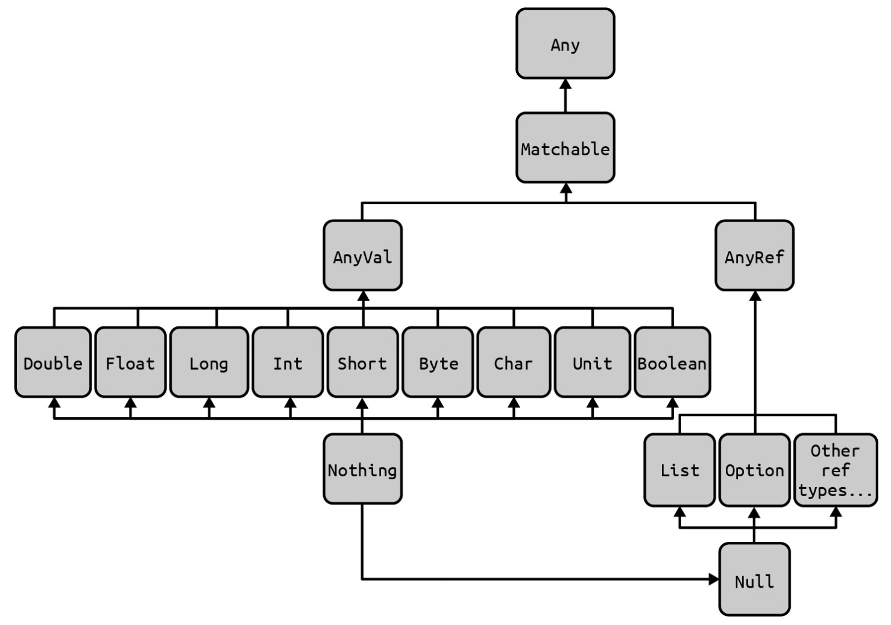
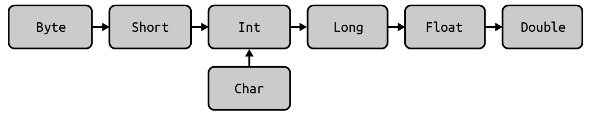

# 3. 数值和日期

本章涵盖了Scala中的数值类型，以及Java 8引入的日期和时间API的使用方法。

在Scala中，**Byte**、**Short**、**Int**、**Long**和**Char**类型被称为*整数类型*，因为它们由整型数字表示。整数类型以及**Double**和**Float**组成了Scala中的*数值类型*。与被称为“非数值类型”的**Unit**和**Boolean**一样，这些数值类型都继承**AnyVal**特质（trait）。在Scala页面（ *https://oreil.ly/C7Id7* ）关于统一类型的讨论中，这9种类型都被称为*预定义值类型*，并且不能为空。

预定义值类型与**AnyVal**和**Any**（以及**Nothing**）的关系如图3-1所示：

* 所有的数值类型都继承自**AnyVal**。

* Scala类层次结构中的所有其他类型都继承自**AnyRef**。



                       *图3-1：所有预定义的数值类型都继承自* ***AnyVal***

如表3-1所示，Scala的数值类型与Java中对应的基本类型有着相同的数值范围。

表3-1：Scala中数值类型的数值范围：

| 类型         | 描述                | 范围                     |
| ---------- | ----------------- | ---------------------- |
| **Char**   | 16位无符号Unicode字符   | 0~65535                |
| **Byte**   | 8位有符号整数           | -128~127               |
| **Short**  | 16位有符号整数          | -32768~32767           |
| **Int**    | 32位有符号整数          | -2147483648~2147483647 |
| **Long**   | 64位有符号整数          | -2^63~2^63-1           |
| **Float**  | 32位IEEE 754单精度浮点数 | 见下文                    |
| **Double** | 64位IEEE 754双精度浮点数 | 见下文                    |

除此之外，**Boolean**可以为**true**或者**false**。

如果想知道数据范围的精确值，但手头没有这本书，可以在Scala REPL中查看：

```scala
    Char.MinValue.toInt // 0
    Char.MaxValue.toInt // 65535
    Byte.MinValue       // -128
    Byte.MaxValue       // +127
    Short.MinValue      // −32768
    Short.MaxValue      // +32767
    Int.MinValue        // −2147483648
    Int.MaxValue        // +2147483647
    Long.MinValue       // -9,223,372,036,854,775,808
    Long.MaxValue       // +9,223,372,036,854,775,807
    Float.MinValue      // −3.4028235e38
    Float.MaxValue      // +3.4028235e38
    Double.MinValue     // -1.7976931348623157e308
    Double.MaxValue     // +1.7976931348623157e308
```

除了这些基本数值类型之外，**BigInt**和**BigDecimal**在本章后续部分都会讲到。

### 数值常量中的下划线

Scala 2.13中引入了在数值常量中使用下划线的功能：

```scala
    // Int
    val x = 1_000
    val x = 100_000
    val x = 1_000_000

    // Long (也可以使用小写的‘l’, 但看起来容易跟数字’1‘混淆)
    val x = 1_000_000L

    // Double
    val x = 1_123.45
    val x = 1_123.45D
    val x = 1_123.45d
    val x = 1_234e2 // 123400.0

    // Float
    val x = 3_456.7F
    val x = 3_456.7f
    val x = 1_234e2F

    // BigInt and BigDecimal
    val x: BigInt = 1_000_000
    val x: BigDecimal = 1_234.56
```

带下划线的数值常量可以使用在任何常用的地方：

```scala
    val x = 1_000 + 1

    if x > 1_000 && x < 1_000_000 then println(x)

    x match
       case 1_000 => println("got 1,000")
       case _     => println("got something else")

    for
       i <- 1 to 1_000
       if i > 999
    do
       println(i)
```

目前带下划线的数值常量不能使用的一个地方是从**String**转换为数值类型：

```scala
    Integer.parseInt("1_000") // NumberFormatException
    "1_000".toInt             // NumberFormatException
```

### 复数

除了Scala自带的math类库，如果需要其他更强大的数学运算能力，可以了解一下Spire（ *https://typelevel.org/spire* ），它包含了Rational、Complex和Real等更高级的数学概念。

### 日期和时间

本章最后几节介绍了Java 8引入的日期和时间API，并展示了如何使用**LocalDate**、**LocalTime**、**LocalDateTime**、**Instant**和**ZonedDateTime**等新类。

## 3.1 从字符串到数值

### 问题

把一个字符串转换成一个Scala的数值类型。

### 解决方案

可以在**String**上使用 __to*__ 方法：

```scala
    "1".toByte   // Byte = 1
    "1".toShort  // Short = 1
    "1".toInt    // Int = 1
    "1".toLong   // Long = 1
    "1".toFloat  // Float = 1.0
    "1".toDouble // Double = 1.0
```

需要注意的是，这些方法可能会抛出Java的**NumberFormatException**：

```scala
    "hello!".toInt // java.lang.NumberFormatException
```

因此，使用**to*Option**方法也是一个不错的选择，它的作用是在转换成功时返回**Some**，转换失败时返回**None**：

```scala
    "1".toByteOption   // Option[Byte] = Some(1)
    "1".toShortOption  // Option[Short] = Some(1)
    "1".toIntOption    // Option[Int] = Some(1)
    "1".toLongOption   // Option[Long] = Some(1)
    "1".toFloatOption  // Option[Float] = Some(1.0)
    "1".toDoubleOption // Option[Double] = Some(1.0)
    "one".toIntOption  // Option[Int] = None
```

**BigInt**和**BigDecimal**实例也可以通过字符串创建，并且也有可能抛出**NumberFormatException**：

```scala
    val b = BigInt("1")         // BigInt = 1
    val b = BigDecimal("1.234") // BigDecimal = 1.234

    val b = BigInt("yo")        // NumberFormatException
    val b = BigDecimal("dude!") // NumberFormatException
```

#### 处理基数和根

如果想要处理**十进制**以外的计算，使用Scala的**toInt**方法是不支持传入**进制**的参数的。此时可以使用**java.lang.Integer**类的**parseInt**方法，例如：

```scala
    Integer.parseInt("1", 2)   // Int = 1
    Integer.parseInt("10", 2)  // Int = 2
    Integer.parseInt("100", 2) // Int = 4
    Integer.parseInt("1", 8)   // Int = 1
    Integer.parseInt("10", 8)  // Int = 8
```

当然，参考2.11节，也可以使用Scala中的自定义扩展方法来解决这个问题：

```scala
    extension(s: String) {
      def toInt(radix: Int) = java.lang.Integer.parseInt(s, radix)
    }

    "10".toInt(2) // Int = 2
```

### 讨论

如果用过Java把**字符串**转换成数值类型，那么一定会对**NumberFormatException**很熟悉。然而，Scala中并没有受检异常，所以可以用其他方式来处理这个异常。

首先，没有必要在一个Scala方法上声明可能抛出的异常，因此下面的方法定义是合法的：

```scala
    // you're not required to declare "throws NumberFormatException"
    def makeInt(s: String) = s.toInt
```

#### 编写一个纯函数

然而，在函数式编程（FP）中，最好永远不要定义上述的方法。由于可能会抛出异常，所以这种方法可能会造成调用方的代码短路。（如果不希望其他开发人员定义这种方法给你使用，你最好也不要对其他开发人员这样做。）相反，纯函数 ***总是*** 返回其签名所显示的类型。因此，在FP中，可以这样写这个函数：

```scala
    def makeInt(s: String): Option[Int] =
      try
        Some(s.toInt)
      catch
        case e: NumberFormatException => None
```

该函数的返回值类型是**Option[Int]**，这意味着如果给它一个 **“10”**，它将返回一个**Some(10)**，如果给它一个 **“Yo”**，它将返回一个**None**。此函数相当于上述解决办法中的**toIntOption**，该方法在Scala2.13中引入。

TODO（松鼠图）

#### 简化makeInt方法

虽然上述代码 **makeInt(s: String): Option[Int]** 已经比较完美了，但是还可以进一步精简，如下所示：

```scala
    import scala.util.Try
    def makeInt(s: String): Option[Int] = Try(s.toInt).toOption
```

这两种不同定义的**makeInt**方法都会返回 **Some[Int]** 或者 **None**：

```scala
    makeInt("a") // None
    makeInt("1") // Some(1)
    makeInt("2147483647") // Some(2147483647)
    makeInt("2147483648") // None
```

如果更加喜欢**Try**的返回值类型，可以这样做：

```scala
    import scala.util.{Try, Success, Failure}
    def makeInt(s: String): Try[Int] = Try(s.toInt)
```

使用**Try**的优势是当程序发生异常，可以从返回的**Failure**对象中获取具体的异常：

```scala
    makeInt("1") // Success(1)
    makeInt("a") // Failure(java.lang.NumberFormatException: For input string: "a")
```

#### 声明方法的异常

如果期望声明方法会抛出异常，可以通过 **@throws** 注解来标注方法：

```scala
    @throws(classOf[NumberFormatException])
    def makeInt(s: String) = s.toInt
```

如果在Java代码调用这个方法，这个注解式异常声明是必须的。22.7节说明了这点。

### 另见

* 24.6节，更详细讲解了**Option**、**Some**和**None**的使用。

## 3.2 数值类型转换

### 问题

把一个数值类型转换成另一个数值类型，比如把**Int**转成**Double**、**Double**转成**Int**、或者涉及到**BigInt**和**BigDecimal**的转换。

### 解决方案

数值类型通常可以使用一系列 __to*__ 方法进行类型转换，包括**toByte**、**toChar**、**toDouble**、**toFloat**、**toInt**、**toLong**和**toShort**方法。这些方法由**RichDouble**、**RichInt**、**RichFloat**等类添加到基本数值类型中，且自动被类**Scala.Predef**所引入。

在关于Scala统一类型的页面（ *https://oreil.ly/C7Id7* ），数值类型可以很容易按照图3-2所示的方向进行转换。



                           *图3-2：数值类型简单类型转换方向*

一些简单的转换示例：

```scala
    val b: Byte = 1
    b.toShort   // Short = 1
    b.toInt     // Int = 1
    b.toLong    // Long = 1
    b.toFloat   // Float = 1.0
    b.toDouble  // Double = 1.0
```

当按照图示转换方向时，操作很简单。当然也可以按照相反的方向进行转换，如下所示：

```scala
    val d = 100.0 // Double = 100.0
    d.toFloat     // Float = 100.0
    d.toLong      // Long = 1
    d.toInt       // Int = 100
    d.toShort     // Short = 100
    d.toByte      // Byte = 10000
```

然而，按照相反的方向进行转换时，需要注意所产生一些问题：

```scala
    val d = Double.MaxValue // 1.7976931348623157E308

    // intentional error: don’t do these things
    d.toFloat  // Float = Infinity
    d.toLong   // Long = 9223372036854775807
    d.toInt    // Int = 2147483647
    d.toShort  // Short = -1
    d.toByte   // Byte = -1
```

因此，在尝试使用这些转换方法时，最好仔细检查一下转换是否合法：

```scala
    val d: Double = 65_535.0
    d.isValidByte  // false (Byte ranges from -128 to 127)
    d.isValidChar  // true (Char ranges from 0 to 65,535)
    d.isValidShort // false (Short ranges from -32,768 to 32,767)
    d.isValidInt   // true (Int ranges from -2,147,483,648 to 2,147,483,647)
```

注意**Double**类型没有以下检查方法：

```scala
    d.isValidFloat // not a member of Double
    d.isValidLong  // not a member of Double
```

另外请注意，当使用这些方法时，如果**Double**含有非零小数部分，**Int**/**Short**/**Byte**的测试将会失败：

```scala
    val d = 1.5    // Double = 1.5
    d.isValidInt   // false
    d.isValidShort // false
    d.isValidByte  // false
```

#### asInstanceOf

根据使用需求，也可以按照类型转换方向使用**asInstanceOf**方法：

```scala
    val b: Byte = 1 // Byte = 1
    b.asInstanceOf[Short]  // Short = 1
    b.asInstanceOf[Int]    // Int = 1
    b.asInstanceOf[Long]   // Long = 1
    b.asInstanceOf[Float]  // Float = 1.0
    b.asInstanceOf[Double] // Double = 1.0
```

### 讨论

由于所有数值类型都是类（而不是基本类型），所以**BigInt**和**BigDecimal**的使用方式也类似。以下示例展示了如何跟数值类型一起使用。

#### BigInt

**BigInt**的构造函数含有9中不同的重载方式，包括**Int**、**Long**和**String**等入参：

```scala
    val i: Int = 101
    val l: Long = 102
    val s = "103"

    val b1 = BigInt(i) // BigInt = 101
    val b2 = BigInt(l) // BigInt = 102
    val b3 = BigInt(s) // BigInt = 103
```

**BigInt**也包含 __isValid*__ 和 __to*__ 方法来协助进行数值类型的转换：

* isValidByte、toByte

* isValidChar、toChar

* isValidDouble、toDouble

* isValidFloat、toFloat

* isValidInt、toInt

* isValidLong、toLong

* isValidShort、toShort

#### BigDecimal

同样，**BigDecimal**构造函数也含有多种不同的重载方式，包括如下：

```scala
    BigDecimal(100)
    BigDecimal(100L)
    BigDecimal(100.0)
    BigDecimal(100F)
    BigDecimal("100")
    BigDecimal(BigInt(100))
```

**BigDecimal**同样包含 __isValid*__ 和 __to*__ 方法。它还包含 **to*Exact** 方法，使用方式如下：

```scala
    BigDecimal(100).toBigIntExact   // Some(100)
    BigDecimal(100.5).toBigIntExact // None
    BigDecimal(100).toIntExact      // Int = 100
    BigDecimal(100.5).toIntExact    // java.lang.ArithmeticException: ↵
                                      // (Rounding necessary)
    BigDecimal(100.5).toLongExact   // java.lang.ArithmeticException
    BigDecimal(100.5).toByteExact   // java.lang.ArithmeticException
    BigDecimal(100.5).toShortExact  // java.lang.ArithmeticException
```

参考Scaladoc查看更多关于 **BigInt** （ *https://oreil.ly/PGdIE* ）和 **BigDecimal** （ *https://oreil.ly/E6Lsk* ）的使用方法。

## 3.3 重载默认数值类型

### 问题

当使用隐式类型声明一个变量时，Scala会根据变量的具体数值自动地把数值类型赋值给这个变量，并且可以重载其默认的类型。

### 解决方案

如果把1赋给一个变量，并且没有显示声明类型，Scala会把它的类型设置为**Int**：

```scala
    scala> val a = 1
    a: Int = 1
```

因此，如果想显示声明类型，可以这样：

```scala
    val a: Byte = 1   // Byte = 1
    val a: Short = 1  // Short = 1
    val a: Int = 1    // Int = 1
    val a: Long = 1   // Long = 1
    val a: Float = 1  // Float = 1.0
    val a: Double = 1 // Double = 1.0
```

虽然这种样式更让人喜欢，但在表达式末尾指定类型也是合法的：

```scala
    val a = 0: Byte
    val a = 0: Int
    val a = 0: Short
    val a = 0: Double
    val a = 0: Float
```

对于long、double和float，也可以使用以下声明方式：

```scala
    val a = 1l // Long = 1
    val a = 1L // Long = 1
    val a = 1d // Double = 1.0
    val a = 1D // Double = 1.0
    val a = 1f // Float = 1.0
    val a = 1F // Float = 1.0
```

通过在数字前面加一个前导**0x**或**0X**来定义一个十六进制值，并且可以把这个值保存为**Int**或者**Long**类型：

```scala
    val a = 0x20  // Int = 32
    val a = 0x20L // Long = 32
```

### 讨论

创建对象实例时了解这种定义变量的方式很有帮助，其基本语法如下：

```scala
    // general case
    var [name]: [Type] = [initial value]

    // example
    var a: Short = 0
```

这种格式在类初始化变量时非常有用：

```scala
    class Foo:
      var a: Short = 0 // specify a default value
      var b: Short = _ // defaults to 0
      var s: String = _ // defaults to null
```

可以看到，在初始化变量时，可以使用下划线作为占位符。这在创建类成员变量时是可以的，但是在其他情况下，如在方法中定义变量是无效的。对于数值类型，这也不算一个问题，可以赋值为0。但是对于其他类型，可以采用这种方式：

```scala
    var name = null.asInstanceOf[String]
```

但通常的警告是：不要使用null值。最好使用**Option/Some/None**模式，在一些优秀的Scala库和框架中，如Play Framework，这种模式非常常见。在24.5节和24.6节，对这种方式有更深入的讨论。

---

类型归属：

在一些不常见的情形需要使用类型归属（type ascription），Stack Overflow “What Is the Purpose of Type Ascriptions in Scala?”（ *https://oreil.ly/y9eQz* ）上有个例子讲解了把String向上转成Object的好处，实现方式如下：

```scala
    val s = "Hala"    // s: String = Hala
    val o = s: Object // o: Object = Hala
```

如上所示，这个技巧和本节很类似。向上转换（upcast）也被称为类型归属，Scala官方文档（ *https://oreil.ly/eWyge* ）对其的描述如下：

“类型归属是一种发生在编译时，为了满足类型检查器的类型的向上转换。这种情况并不常见，但确实会发生。其中最常见的一种场景是向一个接受变参（varargs）的方法传入一个**Seq**类，将 _* 的类型进行归属。”

---

## 3.4 替代++和−−

### 问题

像其他语言里那样使用++或者--来递增或者递减一个变量，但是Scala里没有这样的操作符。

### 解决方案

由于声明为**val**的字段是不可变的，他们不能递增或递减，但是声明为**var**的**Int**类型变量是可以通过+=和-=方法来修改的：

```scala
    var a = 1 // a = 1
    a += 1    // a = 2
    a −= 1    // a = 1
```

同样，可以通过类似的方法对变量进行乘法和除法操作：

```scala
    var i = 1 // i = 1
    i *= 4    // i = 4
    i /= 2    // i = 2
```

如果想在一个被声明为**val**的字段上调用此方法，会得到一个编译时错误：

```scala
    scala> val x = 1
    x: Int = 1

    scala> x += 1
    <console>:9: error: value += is not a member of Int
                 x += 1
                   ^
```

### 讨论

这种方式的另外一个优势就是可以在除**Int**以外的其他类型上调用这些操作方法，例如在**Double**和**Float**类上：

```scala
    var d = 1.2 // Double = 1.2
    d += 1 // 2.2
    d *= 2 // 4.4
    d /= 2 // 2.2

    var f = 1.2F // Float = 1.2
    f += 1 // 2.2
    f *= 2 // 4.4
    f /= 2 // 2.2
```

----

注意：上面提到，+=、-=、*=和/=并不是操作符，而是方法。这种使用“操作符”来作为方法名的实现方式是Scala里常见的做法。例如，Actors就是通过库而非语言本身实现的。

----

## 3.5 浮点数的比较

### 问题

比较两个浮点数的值，然而，和其他语言一样，两个应该相等的浮点数有可能实际上是不相等的。

### 解决方案

刚开始接触浮点数时，可以知道**0.1**加**0.1**等于**0.2**：

```scala
    scala> 0.1 + 0.1
    res0: Double = 0.2
```

但是**0.1**加**0.2**并不精确等于**0.3**：

```scala
    scala> 0.1 + 0.2
    res1: Double = 0.30000000000000004
```

这个微小的误差使浮点数比较成了一个问题：

```scala
    val a = 0.3       // Double = 0.3
    val b = 0.1 + 0.2 // Double = 0.30000000000000004
    a == b            // false
```

因此，可以定义能容忍一定误差的浮点数比较的函数。下面用*近似相等*的方法来进行演示：

```scala
    import scala.annotation.targetName
    @targetName("approxEqual")
    def ~=(x: Double, y: Double, tolerance: Double): Boolean =
      if (x - y).abs < tolerance then true else false
```

可以这样使用该方法：

```scala
    val a = 0.3        // 0.3
    val b = 0.1 + 0.2  // 0.30000000000000004
    ~=(a, b, 0.0001)   // true
    ~=(b, a, 0.0001)   // true
```

### 讨论

在上述解决方法中 **@targetName** 注解是可选的，但是推荐在使用符号的方法中使用：

* 有助于提高跟其他不支持使用符号方法名的语言之间的互操作性。

* 这使得堆栈分析变得更容易，因为其中使用的是注解提供的方法名，而不是方法的符号名。

* 注解中的名称也会在文档中标注为符号名称的一个可选的别名。

#### 扩展方法

在8.9节中所示，可以在**Double**类上定义一个扩展方法。假设可容忍的误差是**0.5**，可以这样定义扩展方法：

```scala
    extension (x: Double)
      def ~=(y: Double): Boolean = (x - y).abs < 0.5
```

还可以使用条件判断的方式：

```scala
    extension (x: Double)
      def ~=(y: Double): Boolean =
        if (x - y).abs < 0.5 then true else false
```

在任何时候，都可以在两个**Double**值上进行使用：

```scala
    if a ~= b then ...
```

这会让代码更具有可读性。然而，当硬编码容忍误差的值时，做好将该值定义为给定**x**的百分比：

```scala
    extension (x: Double)
      def ~=(y: Double): Boolean =
        // allow a +/- 10% variance
        val xHigh = if x > 0 then x*1.1 else x*0.9
        val xLow = if x > 0 then x*0.9 else x*1.1
        if y >= xLow && y <= xHigh then true else false
```

或者，将**容忍误差值**（tolerance）定义为方法入参：

```scala
    extension (x: Double)
      def ~=(y: Double, tolerance: Double): Boolean =
        if (x - y).abs < tolerance then true else false
```

最后，可以这样使用该扩展方法：

```scala
    1.0 ~= (1.1, .2) // true
    1.0 ~= (0.9, .2) // true

    1.0 ~= (1.21, .2) // false
    1.0 ~= (0.79, .2) // false
```

### 另见

* 所有计算机科学家应该知道的关于浮点数算法的知识（ *https://oreil.ly/K52zn* ）。

* 浮点数精度问题（ *https://oreil.ly/PgxrB* ）。

* 任意精度算法（ *https://oreil.ly/PPdkg* ）。

## 3.6 处理大数

### 问题

编写一个需要处理非常大的整数或者浮点数的程序。

### 解决方案

如果 **Long** 和 **Double** 无法满足“大”的需求，可以使用Scala的 **BigInt** 和 **BigDecimal** 类：

```scala
    val bi = BigInt(1234567890) // BigInt = 1234567890
    val bd = BigDecimal(123456.789) // BigDecimal = 123456.789

    // 数值常量中使用下划线
    val bi = BigInt(1_234_567_890) // BigInt = 1234567890
    val bd = BigDecimal(123_456.789) // BigDecimal = 123456.789
```

**BigInt** 和 **BigDecimal** 是Java **BigInteger** 和 **BigDecimal** 类的封装，并且支持Scala普通数值类型的所有操作符：

```scala
    bi + bi        // BigInt = 2469135780
    bi * bi        // BigInt = 1524157875019052100
    bi / BigInt(2) // BigInt = 617283945
```

可以把它们转换成其他数值类型：

```scala
    // bad conversions
    bi.toByte  // -46
    bi.toChar  // ˒
    bi.toShort // 722

    // correct conversions
    bi.toInt    // 1234567891
    bi.toLong   // 1234567891
    bi.toFloat  // 1.23456794E9
    bi.toDouble // 1.234567891E9
```

为避免错误，可以在转换前测试下是否能够转换：

```scala
    bi.isValidByte  // false
    bi.isValidChar  // false
    bi.isValidShort // false
    bi.isValidInt   // true
    bi.isValidLong  // true
```

**BigInt**也可以转换成**Array[Byte]**:

```scala
bi.toByteArray // Array[Byte] = Array(73, -106, 2, -46)
```

### 讨论

在使用**BigInt**或者**BigDecimal**之前，可以检查下**Long**和**Double**能处理的最小和最大值：

```scala
    Long.MinValue   // -9,223,372,036,854,775,808
    Long.MaxValue   // +9,223,372,036,854,775,807
    Double.MinValue // -1.7976931348623157e308
    Double.MaxValue // +1.7976931348623157e308
```

根据需要，也可以使用普通数值类型的**PositiveInfinity**和**NegativeInfinity**：

```scala
    scala> 1.7976931348623157E308 > Double.PositiveInfinity
    res0: Boolean = false
```

TODO（松鼠图）

#### BigDecimal经常在货币中使用

**BigDecimal**通常用于表示货币，因为它提供了对舍入行为的控制。如之前的章节所示，`$0.10`加`$0.20`不能精确表示`$0.30`：

```scala
    0.10 + 0.20 // Double = 0.30000000000000004
```

但是**BigDecimal**避免了这个问题：

```scala
    BigDecimal(0.10) + BigDecimal(0.20) // BigDecimal = 0.3
```

尽管如此，在**BigDecimal**构造函数中使用**Double**可能还会产生一些问题：

```scala
    BigDecimal(0.1 + 0.2) // BigDecimal = 0.30000000000000004
    BigDecimal(.2 * .7)   // BigDecimal = 0.13999999999999999
```

因此，推荐在**BigDecimal**构造函数中使用**String**来获取准确的结果：

```scala
    BigDecimal("0.1") + BigDecimal("0.2") // BigDecimal = 0.3
    BigDecimal("0.2") * BigDecimal("0.7") // BigDecimal = 0.14
```

正如Joshua Bloch在《Effective Java》（Addison Wesley）中所说：“使用BigDecimal、int或long进行货币计算”。

### 另见

* Baeldung的“Java中的BigDecimal和BigInteger”（ *https://oreil.ly/3pdrS* ）含有大量的使用细节。

* 如果想要将这些数据类型存储到数据库，这些页面可能会提供一些帮助：
  
  * Stack Overflow的”How to Insert BigInteger in Prepared Statement Java”（ *https://oreil.ly/kdn73* ）
  
  * Stack Overflow的“Store BigInteger into MySql” （ *https://oreil.ly/5lQgk* ）

* Stack Overflow的“Unpredictability of the BigDecimal(double) Constructor”（ *https://oreil.ly/62ZSQ* ）讨论了在Java中将 **double** 传递给 **BigDecimal** 的问题。

## 3.7 生成随机数

### 问题

当前有很多需要创建随机数的场景，比如测试一个程序，运行仿真系统等。

### 解决方案

使用Scala的**scala.util.Random**生成随机数，下面列出一些使用示例：

```scala
    val r = scala.util.Random

    // random integers
    r.nextInt // 455978773
    r.nextInt // -1837771511

    // returns a value between 0.0 and 1.0
    r.nextDouble // 0.22095085955974536
    r.nextDouble // 0.3349793259700605

    // returns a value between 0.0 and 1.0
    r.nextFloat // 0.34705013
    r.nextFloat // 0.79055405

    // set a seed when creating a new Random
    val r = scala.util.Random(31)

    // update the seed after you already have a Random instance
    r.setSeed(1_000L) 


    // limit the integers to a maximum value
    r.nextInt(6) // 0
    r.nextInt(6) // 5
    r.nextInt(6) // 1
```

当在**nextInt**方法上传入一个最大值，方法将会返回一个0（包括）到给定的值（不包括）之间的随机数。比如，给定100将会返回一个0到99之间的随机数。

### 讨论

这一小节将会展示一些**Random**类的常用方式。

#### 生成随机长度的range

Scala中创建一个随机长度的range，这在测试时会非常有用，也十分方便：

```scala
    // random length ranges
    0 to r.nextInt(10) // Range 0 to 9
    0 to r.nextInt(10) // Range 0 to 3
    0 to r.nextInt(10) // Range 0 to 7
```

当然，**Range**可以按需转换成集合序列：

```scala
    // the resulting list size will be random
    (0 to r.nextInt(10)).toList // List(0, 1, 2, 3, 4)
    (0 to r.nextInt(10)).toList // List(0, 1, 2)

    // a random size LazyList
    (0 to r.nextInt(1_000_000)).to(LazyList)
        // result: LazyList[Int] = LazyList(<not computed>)
```

也可以通过**for**/**yield**循环来修改这些数值：

```scala
    for i <- 0 to r.nextInt(10) yield i * 10
```

可能会产生如下的序列：

```scala
    Vector(0, 10, 20, 30)
    Vector(0, 10)
    Vector(0, 10, 20, 30, 40, 50, 60, 70, 80)
```

#### 生成固定长度的随机数

可以创建一个长度已知的序列，序列中的值是随机生成的：

```scala
    val seq = for i <- 1 to 5 yield r.nextInt(100)
```

可能会产生如下包含5个随机数的序列：

```scala
    Vector(99, 6, 40, 77, 19)
    Vector(1, 75, 87, 55, 39)
    Vector(46, 40, 4, 82, 92)
```

同样，使用 **nextFloat** 和 **nextDouble** 方法也类似：

```scala
    val floats = for i <- 1 to 5 yield r.nextFloat()
    val doubles = for i <- 1 to 5 yield r.nextDouble()
```

#### 打乱序列的元素

另一个常见的需求是”随机化“一个现有的序列。因此，可以使用**Random**类中的**shuffle**方法：

```scala
    import scala.util.Random
    val x = List(1, 2, 3)

    Random.shuffle(x) // List(3, 1, 2)
    Random.shuffle(x) // List(2, 3, 1)
```

#### 从序列中随机取出一个元素

已知一个存在的序列，想要从中随机获取一个元素，可以这样做：

```scala
    import scala.util.Random
    def getRandomElement[A](list: Seq[A], random: Random): A =
      list(random.nextInt(list.length))
```

下面列出一些使用**getRandomElement**方法的示例：

```scala
    val r = scala.util.Random

    // integers
    val ints = (1 to 100).toList
    getRandomElement(ints, r) // Int = 66
    getRandomElement(ints, r) // Int = 11

    // strings
    val names = List("Hala", "Helia", "Hannah", "Hope")
    getRandomElement(names, r) // Hala
    getRandomElement(names, r) // Hannah
```

## 3.8 格式化数值和金额

### 问题

对数值或者金额的小数位数或逗号进行格式化，特别是在输出时。

### 解决方案

对于基本数值的格式化，可以使用 **f** 字符串插值器。对于其他需求，比如添加逗号、本地化输出和货币处理，可以使用**java.text.NumberFormat**的相关实例：

```scala
    NumberFormat.getInstance         // general-purpose numbers (floating-point)
    NumberFormat.getIntegerInstance  // integers
    NumberFormat.getCurrencyInstance // currency
    NumberFormat.getPercentInstance  // percentages
```

**NumberFormat**实例也可以自定义地区（locales）。

#### f 字符串插值器

在2.4节讨论了 **f** 字符串插值器的相关内容，可以对简单的数值进行格式化：

```scala
    val pi = scala.math.Pi // Double = 3.141592653589793
    println(f"${pi}%1.5f") // 3.14159
```

更多使用这个技巧的例子：

```scala
    // floating-point
    f"${pi}%1.2f" // String = 3.14
    f"${pi}%1.3f" // String = 3.142
    f"${pi}%1.5f" // String = 3.14159
    f"${pi}%6.2f" // String = " 3.14"
    f"${pi}%06.2f" // String = 003.14

    // whole numbers
    val x = 10_000
    f"${x}%d" // 10000
    f"${x}%2d" // 10000
    f"${x}%8d" // " 10000"
    f"${x}%-8d" // "10000 "
```

如果更偏爱显式调用字符串中的**format**方法，可以像下面一样写代码：

```scala
    "%06.2f".format(pi) // String = 003.14
```

#### 逗号，本地化和整数

如果想格式化整数数值，比如像美国在整数中添加逗号，可以使用**NumberFormat**类的**getIntegerInstance**：

```scala
    import java.text.NumberFormat
    val formatter = NumberFormat.getIntegerInstance
    formatter.format(10_000)    // String = 10,000
    formatter.format(1_000_000) // String = 1,000,000
```

由于本书作者所处的地区靠近美国的科罗拉多州丹佛附近，所以示例中的输出添加了逗号。**getIntegerInstance**也支持传入自定义的**Locale**类（ *https://oreil.ly/lYaAj* ）参数：

```scala
    import java.text.NumberFormat
    import java.util.Locale

    val formatter = NumberFormat.getIntegerInstance(Locale.GERMANY)
    formatter.format(1_000)     // 1.000
    formatter.format(10_000)    // 10.000
    formatter.format(1_000_000) // 1.000.000
```

#### 逗号，本地化和浮点数

可以通过**getInstance**获取一个formatter用来处理浮点数：

```scala
    val formatter = NumberFormat.getInstance
    formatter.format(12.34)        // 12.34
    formatter.format(1_234.56)     // 1,234.56
    formatter.format(1_234_567.89) // 1,234,567.89
```

也可以设置自定义的*locale*参数：

```scala
    val formatter = NumberFormat.getInstance(Locale.GERMANY)
    formatter.format(12.34)        // 12,34
    formatter.format(1_234.56)     // 1.234,56
    formatter.format(1_234_567.89) // 1.234.567,89
```

#### 货币

对于货币金额的输出，可以使用**getCurrencyInstance**返回的formatter。默认使用美元的格式输出：

```scala
    val formatter = NumberFormat.getCurrencyInstance
    formatter.format(123.456789)   // $123.46
    formatter.format(12_345.6789)  // $12,345.68
    formatter.format(1_234_567.89) // $1,234,567.89
```

使用**Locale**格式化为国际货币的格式：

```scala
    import java.util.{Currency, Locale}

    val deCurrency = Currency.getInstance(Locale.GERMANY)
    val deFormatter = java.text.NumberFormat.getCurrencyInstance
    deFormatter.setCurrency(deCurrency)

    deFormatter.format(123.456789)   // €123.46
    deFormatter.format(12_345.6789)  // €12,345.68
    deFormatter.format(1_234_567.89) // €1,234,567.89
```

如果不使用**Currency**类，**getCurrencyInstance**也可以格式化**BigDecimal**。下面使用默认的美元格式输出：

```scala
    import java.text.NumberFormat
    import scala.math.BigDecimal.RoundingMode

    val a = BigDecimal("10000.995")          // BigDecimal = 10000.995
    val b = a.setScale(2, RoundingMode.DOWN) // BigDecimal = 10000.99

    val formatter = NumberFormat.getCurrencyInstance
    formatter.format(b)                     // String = $10,000.99
```

使用自定义locale的示例：

```scala
    import java.text.NumberFormat
    import java.util.Locale
    import scala.math.BigDecimal.RoundingMode

    val b = BigDecimal("1234567.891").setScale(2, RoundingMode.DOWN)
     // result: BigDecimal = 1234567.89

    val deFormatter = NumberFormat.getCurrencyInstance(Locale.GERMANY)
    deFormatter.format(b) // String = 1.234.567,89 €

    val ukFormatter = NumberFormat.getCurrencyInstance(Locale.UK)
    ukFormatter.format(b) // String = £1,234,567.89
```

#### 自定义格式化模式

可以使用**DecimalFormat**类创建自定义的格式化模式。只需要随便创建一个**pattern**，然后使用**format**方法作用在一个数值上，下面列出一些示例：

```scala
    import java.text.DecimalFormat

    val df = DecimalFormat("0.##")
    df.format(123.45)        // 123.45 (type = String)
    df.format(123.4567890)   // 123.46
    df.format(.1234567890)   // 0.12
    df.format(1_234_567_890) // 1234567890

    val df = DecimalFormat("0.####")
    df.format(.1234567890)   // 0.1235
    df.format(1_234.567890)  // 1234.5679
    df.format(1_234_567_890) // 1234567890

    val df = DecimalFormat("#,###,##0.00")
    df.format(123)           // 123.00
    df.format(123.4567890)   // 123.46
    df.format(1_234.567890)  // 1,234.57
    df.format(1_234_567_890) // 1,234,567,890.00
```

更多格式化模式字符可以参考Java的**DecimalFormat**类（ *https://oreil.ly/nvJda* ）。还有一个值得注意的是，通常情况下最好不用直接创建**DecimalFormat**的实例，可以使用**NumberFormat**类。

### 本地化

**java.util.Locale**类有三个构造函数：

```scala
    Locale(String language)
    Locale(String language, String country)
    Locale(String language, String country, String data)
```

它还包括比如**CANADA、CHINA、FRANCE、GERMANY、JAPAN、UK、US**等很多地区的静态实例。对于一些**Locale**不支持的国家和语言，可以使用语言或者语言/国家的字符串来表示。比如，根据Oracle’s JDK 10和JRE 10所支持的地区页面（ *https://oreil.ly/fjQXp* ），India地区可以这样表示：

```scala
    Locale("hi-IN", "IN")
    Locale("en-IN", "IN")
```

更多使用示例：

```scala
    Locale("en-AU", "AU") // Australia
    Locale("pt-BR", "BR") // Brazil
    Locale("es-ES", "ES") // Spain
```

下面的例子演示了如何使用India地区：

```scala
    // India
    import java.util.{Currency, Locale}

    val indiaLocale = Currency.getInstance(Locale("hi-IN", "IN"))
    val formatter = java.text.NumberFormat.getCurrencyInstance
    formatter.setCurrency(indiaLocale)

    formatter.format(123.456789)  // ₹123.46
    formatter.format(1_234.56789) // ₹1,234.57
```

对于**NumberFormat**类中的所有**get*Instance**方法，可以设置一个默认的locale：

```scala
    import java.text.NumberFormat
    import java.util.Locale

    val default = Locale.getDefault
    val formatter = NumberFormat.getInstance(default)

    formatter.format(12.34)        // 12.34
    formatter.format(1_234.56)     // 1,234.56
    formatter.format(1_234_567.89) // 1,234,567.89
```

### 讨论

本章使用Java中的类库来处理输出金额和格式化数值，当然，关于金额的处理依赖于项目的实际需求。在我的咨询生涯里，看到大多数公司采用Java的**BigDecimal**类来处理金额，还有一些公司基于**BigDecimal**创建了自定义的金额处理类。

## 3.9 新的日期和时间

### 问题

使用Java8新引入的Date和Time API。

### 解决方案

使用Java8的API，你可以创建新的date，time和date/time值。表3-2提供了一些新类的描述（参考 **java.time** 的Javadoc（ *https://oreil.ly/7T8dh* ）），并且所有这些类兼容ISO-8601 calendar系统。

表3-2：Java8常用的Date和Time类

| 类名            | 描述                                                      |
| ------------- | ------------------------------------------------------- |
| LocalDate     | 不包含时区的日期类型，比如 2007-12-03。                               |
| LocalTime     | 不包含时区的时间类型，比如 10:15:30。                                 |
| LocalDateTime | 不包含时区的日期-时间类型，比如 2007-12-03T10:15:30。                   |
| ZonedDateTime | 包含时区的日期-时间类型，比如 2007-12-03T10:15:30+01:00 Europe/Paris。 |
| Instant       | 为时间轴上的单一瞬时点建模。这可能用于记录应用程序中事件的时间戳。                       |

创建新的date/time实例：

* 使用这些类中的**now**方法创建表示当前时刻的实例。

* 使用这些类中的**of**方法创建表示过去或者未来时刻的实例。

#### now

使用API中新类的**now**方法，可以创建表示当前日期和时间的实例：

```scala
    import java.time.*

    LocalDate.now      // 2019-01-20
    LocalTime.now      // 12:19:26.270
    LocalDateTime.now  // 2019-01-20T12:19:26.270  
    Instant.now        // 2019-01-20T19:19:26.270Z
    ZonedDateTime.now  // 2019-01-20T12:44:53.466-07:00[America/Denver]
```

这些方法的结果展示了每种类型中存储的数据。

#### 过去或未来

使用API中新类的**of**方法，可以创建表示过去或者未来的日期和时间的实例。比如，下面使用**of**方法创建**java.time.LocalDate**类（ *https://oreil.ly/qXo7f* ）的实例：

```scala
    val squirrelDay = LocalDate.of(2020, 1, 21)
    val squirrelDay = LocalDate.of(2020, Month.JANUARY, 21)
    val squirrelDay = LocalDate.of(2020, 1, 1).plusDays(20)
```

注意使用**LocalDate**，一月使用**1**代表，而不是**0**。

**java.time.LocalDate**（ *https://oreil.ly/TNNWb* ）含有5个 __of*__ 方法，包含如下：

```scala
    LocalTime.of(hour: Int, minute: Int)
    LocalTime.of(hour: Int, minute: Int, second: Int)

    LocalTime.of(0, 0) // 00:00
    LocalTime.of(0, 1) // 00:01
    LocalTime.of(1, 1) // 01:01
    LocalTime.of(23, 59) // 23:59
```

下面刻意通过异常的方式来演示下合法的分钟和小时：

```scala
    LocalTime.of(23, 60) // DateTimeException: Invalid value for MinuteOfHour,
                         // (valid values 0 - 59): 60

    LocalTime.of(24, 1)  // DateTimeException: Invalid value for HourOfDay,
                         // (valid values 0 - 23): 24
```

**java.time.LocalDateTime**（ *https://oreil.ly/eHIH4* ）含有9个 __of*__ 方法，包含如下:

```scala
    LocalDateTime.of(year: Int, month: Int, dayOfMonth: Int, hour: Int, minute: Int)
    LocalDateTime.of(year: Int, month: Month, dayOfMonth: Int, hour: Int, minute: Int)
    LocalDateTime.of(date: LocalDate, time: LocalTime)
```

**java.time.ZonedDateTime**（ *https://oreil.ly/nmoY3* ）含有7个 __of*__ 方法，包含如下：

```scala
    of(int year, int month, int dayOfMonth, int hour, int minute, int second, 
       int nanoOfSecond, ZoneId zone)
    of(LocalDate date, LocalTime time, ZoneId zone)
    of(LocalDateTime localDateTime, ZoneId zone)
    ofInstant(Instant instant, ZoneId zone)
```

下面使用**ZonedDateTime**类的第二个方法做个示例：

```scala
    val zdt = ZonedDateTime.of(
      LocalDate.now,
      LocalTime.now,
      ZoneId.of("America/New_York")
    )
    // result: 2021-01-01T20:38:57.590542-05:00[America/New_York]
```

顺便提一嘴，上面示例中**java.time.ZoneId**（ *https://oreil.ly/h7A9T* ）还有一些其他值：

```scala
    ZoneId.of("Europe/Paris")     // java.time.ZoneId = Europe/Paris
    ZoneId.of("Asia/Tokyo")       // java.time.ZoneId = Asia/Tokyo
    ZoneId.of("America/New_York") // java.time.ZoneId = America/New_York

    // an offset from UTC (Greenwich) time
    ZoneId.of("UTC+1")            // java.time.ZoneId = UTC+01:00
```

最后，**java.time.Instant**（ *https://oreil.ly/aThjs* ）含有3个 __of*__ 方法：

```scala
    Instant.ofEpochMilli(epochMilli: Long)
    Instant.ofEpochSecond(epochSecond: Long)
    Instant.ofEpochSecond(epochSecond: Long, nanoAdjustment: Long)

    Instant.ofEpochMilli(100) // Instant = 1970-01-01T00:00:00.100Z
```

**Instant**是一个很不错的类，比如它能够计算两个实例之间的时间差：

```scala
    import java.time.{Instant, Duration}

    val start = Instant.now                    // Instant = 2021-01-02T03:41:20.067769Z
    Thread.sleep(2_000)
    val stop = Instant.now                     // Instant = 2021-01-02T03:41:22.072429Z
    val delta = Duration.between(start, stop)  // Duration = PT2.00466S
    delta.toMillis                             // Long = 2004
    delta.toNanos                              // Long = 2004660000
```

## 3.10 计算两个日期的差值

### 问题

需要确定两个日期之间的差值。

### 解决办法

如果需要确定两个日期之间**天数**的差值，**java.time.temporal.ChronoUnit**类（ *https://oreil.ly/ydsbP* ）中的**DAYS**枚举是一个最简单的解决方案：

```scala
    import java.time.LocalDate
    import java.time.temporal.ChronoUnit.DAYS

    val now = LocalDate.of(2019, 1, 20)   // 2019-01-20
    val xmas = LocalDate.of(2019, 12, 25) // 2019-12-25

    DAYS.between(now, xmas)               // Long = 339
```

如果需要确定两个日期之间**年数**或**月数**的差值，可以使用**ChronoUnit**类中的**YEARS**和**MONTHS**枚举：

```scala
    import java.time.LocalDate
    import java.time.temporal.ChronoUnit.*

    val now = LocalDate.of(2019, 1, 20)              // 2019-01-20
    val nextXmas = LocalDate.of(2020, 12, 25)        // 2020-12-25

    val years: Long = YEARS.between(now, nextXmas)   // 1
    val months: Long = MONTHS.between(now, nextXmas) // 23
    val days: Long = DAYS.between(now, nextXmas)     // 705
```

使用上面相同的**LocalDate**实例值，也可以结合**Period**类进行使用，但请注意**ChronoUnit**和**Period**方法之间的输出有显著差异：

```scala
    import java.time.Period

    val diff = Period.between(now, nextXmas) // P1Y11M5D
    diff.getYears  // 1
    diff.getMonths // 11
    diff.getDays   // 5
```

### 讨论

**ChronoUnit**的**between**方法含有两个**Temporal**类的入参：

```scala
    between(temporal1Inclusive: Temporal, temporal2Exclusive: Temporal)
```

因此，方法支持所有**Temporal**的子类，包括**Instant、LocalDate、LocalDateTime、LocalTime、ZonedDateTime**等等。下面是使用**LocalDateTime**的示例：

```scala
    import java.time.LocalDateTime
    import java.time.temporal.ChronoUnit

    // of(year, month, dayOfMonth, hour, minute)
    val d1 = LocalDateTime.of(2020, 1, 1, 1, 1)
    val d2 = LocalDateTime.of(2063, 4, 5, 1, 1)

    ChronoUnit.DAYS.between(d1, d2)     // Long = 15800
    ChronoUnit.YEARS.between(d1, d2)    // Long = 43
    ChronoUnit.MINUTES.between(d1, d2)  // Long = 22752000
```

**ChronoUnit**类还包括很多其他的枚举类型，包括**CENTURIES、DECADES、HOURS、MICROS、MILLIS、SECONDS、WEEKS、YEARS**等等，用来处理世纪、数十年、小时、微秒、毫秒、秒、周、年等等。

## 3.11 格式化日期

### 问题

需要按照一定的格式打印日期。

### 解决办法

使用**java.time.format.DateTimeFormatter**类（ *https://oreil.ly/qWHWM* ）。它提供了3种打印日期和时间的格式：

* 内置的格式

* 本地化的格式

* 自定义的格式

#### 内置的格式

**DateTimeFormatter**提供了15中内置的格式可供使用。下面结合**LocalDate**进行示例：

```scala
    import java.time.LocalDate
    import java.time.format.DateTimeFormatter
    val d = LocalDate.now // 2021-02-04

    val f = DateTimeFormatter.BASIC_ISO_DATE
    f.format(d)           // 20210204
```

其他的日期格式比如：

```scala
    ISO_LOCAL_DATE    // 2021-02-04
    ISO_DATE          // 2021-02-04
    BASIC_ISO_DATE    // 20210204
    ISO_ORDINAL_DATE  // 2021-035
    ISO_WEEK_DATE     // 2021-W05-4
```

#### 本地化的格式

使用**DateTimeFormatter**的静态方法来创建本地化的格式：

* **ofLocalizedDate**

* **ofLocalizedTime**

* **ofLocalizedDateTime**

当创建本地化日期时，也可以使用**java.time.format.FormatStyle**（ *https://oreil.ly/K50kH* ）中的4个枚举：

* **SHORT**

* **MEDIUM**

* **LONG**

* **FULL**

下面结合**LocalDate**和**FormatStyle.FULL**来演示下**ofLocalizedDate**的使用：

```scala
    import java.time.LocalDate
    import java.time.format.{DateTimeFormatter, FormatStyle}

    val d = LocalDate.of(2021, 1, 1)
    val f = DateTimeFormatter.ofLocalizedDate(FormatStyle.FULL)
    f.format(d) // Friday, January 1, 2021
```

使用同样的技巧，4种**FormatStyle**的输出看起来像这样：

```scala
    SHORT  // 1/1/21
    MEDIUM // Jan 1, 2021
    LONG   // January 1, 2021
    FULL   // Friday, January 1, 2021
```

#### 自定义的格式

可以使用**DateTimeFormatter**类的**ofPattern**方法创建自定义的字符串模式。下面例举了一些示例：

```scala
    import java.time.LocalDate
    import java.time.format.DateTimeFormatter

    val d = LocalDate.now // 2021-01-01
    val f = DateTimeFormatter.ofPattern("yyyy-MM-dd")
    f.format(d)           // 2021-01-01
```

下面是一些常用的字符串模式：

```scala
    "MM/dd/yyyy"     // 01/01/2021
    "MMM dd, yyyy"   // Jan 01, 2021
    "E, MMM dd yyyy" // Fri, Jan 01 2021
```

接下来演示如何格式化**LocalTime**类：

```scala
    import java.time.LocalTime 
    import java.time.format.DateTimeFormatter

    val t = LocalTime.now
    val f1 = DateTimeFormatter.ofPattern("h:mm a")
    f1.format(t) // 6:48 PM 

    val f2 = DateTimeFormatter.ofPattern("HH:mm:ss a")
    f2.format(t) // 18:48:33 PM
```

使用**LocalDateTime**类，可以同时格式化日期和时间：

```scala
    import java.time.LocalDateTime
    import java.time.format.DateTimeFormatter

    val t = LocalDateTime.now
    val f = DateTimeFormatter.ofPattern("MMM dd, yyyy h:mm a")
    f.format(t) // Jan 01, 2021 6:48 PM
```

更详细的内置格式以及合法的字符串模式（pattern），参考DateTimeFormatter类（ *https://oreil.ly/qWHWM* ）。

## 3.12 从字符串到日期

### 问题

需要将字符串转换成Java8引入的日期/时间类型。

### 解决方案

如果字符串是一个合法的格式，那么直接使用相关类的**parse**方法。否则，需要创建一个自定义的**formatter**来格式化该字符串。

#### LocalDate

下面例子使用**java.time.LocalDate**默认的格式化方法：

```scala
    import java.time.LocalDate
    val d = LocalDate.parse("2020-12-10") // LocalDate = 2020-12-10
```

如果向**parse**方法中传入了错误的时间格式字符串，将会抛出异常：

```scala
    val d = LocalDate.parse("2020/12/10") // java.time.format.DateTimeParseException
```

为了满足不同格式字符串的转换，需要创建一个与之对应的**formatter**：

```scala
    import java.time.format.DateTimeFormatter
    val df = DateTimeFormatter.ofPattern("yyyy/MM/dd")
    val d = LocalDate.parse("2020/12/10", df) // LocalDate = 2020-12-10
```

#### LocalTime

下面例子使用**java.time.LocalTime**默认的格式化方法：

```scala
    import java.time.LocalTime
    val t = LocalTime.parse("01:02")    //01:02
    val t = LocalTime.parse("13:02:03") //13:02:03
```

请注意，每个字段都需要一个前导**0**：

```scala
    val t = LocalTime.parse("1:02")    //java.time.format.DateTimeParseException
    val t = LocalTime.parse("1:02:03") //java.time.format.DateTimeParseException
```

接下来的示例演示了使用formatter的一些方法：

```scala
    import java.time.format.DateTimeFormatter
    LocalTime.parse("00:00", DateTimeFormatter.ISO_TIME)
      // 00:00
    LocalTime.parse("23:59", DateTimeFormatter.ISO_LOCAL_TIME)
      // 23:59
    LocalTime.parse("23 59 59", DateTimeFormatter.ofPattern("HH mm ss"))
      // 23:59:59
    LocalTime.parse("11 59 59 PM", DateTimeFormatter.ofPattern("hh mm ss a"))
      // 23:59:59
```

#### LocalDateTime

下面例子使用**java.time.LocalDateTime**默认的格式化方法：

```scala
    import java.time.LocalDateTime
    val s = "2021-01-01T12:13:14"
    val ldt = LocalDateTime.parse(s) // LocalDateTime = 2021-01-01T12:13:14
```

接下来的示例演示了使用formatter的一些方法：

```scala
    import java.time.LocalDateTime
    import java.time.format.DateTimeFormatter

    val s = "1999-12-31 23:59"
    val f = DateTimeFormatter.ofPattern("yyyy-MM-dd HH:mm")
    val ldt = LocalDateTime.parse(s, f)
      // 1999-12-31T23:59

    val s = "1999-12-31 11:59:59 PM"
    val f = DateTimeFormatter.ofPattern("yyyy-MM-dd hh:mm:ss a")
    val ldt = LocalDateTime.parse(s, f)
      // 1999-12-31T23:59:59
```

#### Instant

**java.time.Instant**类只有一个**parse**方法，且需要传入一个正确的日期/时间格式的字符串：

```scala
    import java.time.Instant
    Instant.parse("1970-01-01T00:01:02.00Z") // 1970-01-01T00:01:02Z
    Instant.parse("2021-01-22T23:59:59.00Z") // 2021-01-22T23:59:59Z
```

#### ZonedDateTime

下面例子使用**java.time.ZonedDateTime**默认的格式化方法：

```scala
    import java.time.ZonedDateTime

    ZonedDateTime.parse("2020-12-31T23:59:59-06:00")
      // ZonedDateTime = 2020-12-31T23:59:59-06:00

    ZonedDateTime.parse("2020-12-31T23:59:59-00:00[US/Mountain]")
      // ZonedDateTime = 2020-12-31T16:59:59-07:00[US/Mountain]
```

接下来的示例演示了使用formatter的一些方法：

```scala
    import java.time.ZonedDateTime
    import java.time.format.DateTimeFormatter.*

    val zdt = ZonedDateTime.parse("2021-01-01T01:02:03Z", ISO_ZONED_DATE_TIME)
      // ZonedDateTime = 2021-01-01T01:02:03Z

    ZonedDateTime.parse("2020-12-31T23:59:59+01:00", ISO_DATE_TIME)
      // ZonedDateTime = 2020-12-31T23:59:59+01:00

    ZonedDateTime.parse("2020-02-29T00:00:00-05:00", ISO_OFFSET_DATE_TIME)
      // ZonedDateTime = 2020-02-29T00:00-05:00

    ZonedDateTime.parse("Sat, 29 Feb 2020 00:01:02 GMT", RFC_1123_DATE_TIME)
      // ZonedDateTime = 2020-02-29T00:01:02Z
```

请注意，传入不正确的日期（或格式不正确的日期）将引会抛出异常：

```scala
    ZonedDateTime.parse("2021-02-29T00:00:00-05:00", ISO_OFFSET_DATE_TIME)
      // java.time.format.DateTimeParseException: Text '2021-02-29T00:00:00-05:00'
      // could not be parsed: Invalid date 'February 29' as '2021' is not a leap year

    ZonedDateTime.parse("Fri, 29 Feb 2020 00:01:02 GMT", RFC_1123_DATE_TIME)
      // java.time.format.DateTimeParseException: Text
      // 'Fri, 29 Feb 2020 00:01:02 GMT' could not be parsed: Conflict found:
      // Field DayOfWeek 6 differs from DayOfWeek 5 derived from 2020-02-29
```
