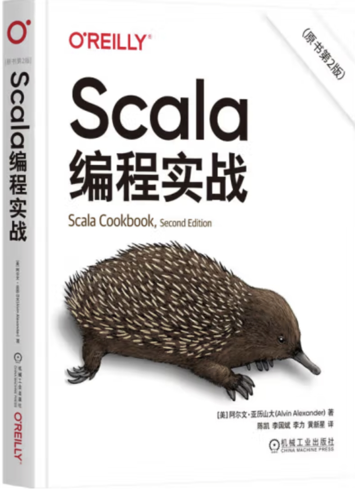

Scala Cookbook 2nd Edition中文
---

**本仓库是首版草稿，语言和描述上有些许不足，甚至错误，仅供参考。**

**经济允许的可以购买正版，支持一下！谢谢！**

**本初稿仅供于学习用途，版权所有，禁止转载！**

- 京东 https://item.jd.com/14161936.html
- 当当 https://product.dangdang.com/29630059.html
- Gitbook https://dreamylost.gitbook.io/scalacookbook2/

# B站讲解视频
- Up主[资深Scala摸鱼师](https://space.bilibili.com/60152799)，讲解人：梦境迷离

# 总负责人

- [梦境迷离](https://github.com/jxnu-liguobin)

# 审校

1. Neo Lin - 第一审校人
2. zhuqingchao
3. 明扬
4. Kerr
5. Counter

# 排版

- [梦境迷离](https://github.com/jxnu-liguobin)
- [IceMimosa](https://github.com/IceMimosa)

# 章节明细

| 章节                                                                          | 负责人                                             |
|-----------------------------------------------------------------------------|-------------------------------------------------|
| [0.序言](0.序言.md)                                                             | [梦境迷离](https://github.com/jxnu-liguobin)        |
| [1.命令行任务](./1.命令行任务.md)                                                     | [hxx0215](https://github.com/hxx0215)           |
| [2.字符串](./2.字符串.md)                                                         | [hxx0215](https://github.com/hxx0215)           |
| [3.数值和日期](./3.数值和日期.md)                                                     | [IceMimosa](https://github.com/IceMimosa)       |
| [4.控制结构](./4.控制结构.md)                                                       | [Donvi](https://github.com/Donvi)               |
| [5.类](./5.类.md)                                                             | [hxx0215](https://github.com/hxx0215)           |
| [6.特质和枚举](./6.特质和枚举.md)                                                     | [梦境迷离](https://github.com/jxnu-liguobin)        |
| [7.对象](./7.对象.md)                                                           | [IceMimosa](https://github.com/IceMimosa)       |
| [8.方法](./8.方法.md)                                                           | [IceMimosa](https://github.com/IceMimosa)       |
| [9.包和导入](./9.包和导入.md)                                                       | [xiaozhiliaoo](https://github.com/xiaozhiliaoo) |
| [10.函数式编程](./10.函数式编程.md)                                                   | [梦境迷离](https://github.com/jxnu-liguobin)        |
| [11.集合：介绍](./11.集合：介绍.md)                                                   | [xiaozhiliaoo](https://github.com/xiaozhiliaoo) |
| [12.集合：常见序列](./12.集合：常见序列类.md)                                              | [xiaozhiliaoo](https://github.com/xiaozhiliaoo) |
| [13.集合：通用的序列方法](13.集合：常见序列方法.md)                                            | [xiaozhiliaoo](https://github.com/xiaozhiliaoo) |
| [14.集合：Map的使用](./14.集合：Map的使用.md)                                           | [IceMimosa](https://github.com/IceMimosa)       |
| [15.集合：Tuple、Range、Set、Stack和Queue](./15.集合：Tuple、Range、Set、Stack和Queue.md) | [IceMimosa](https://github.com/IceMimosa)       |
| [16.文件和进程](./16.文件和进程.md)                                                   | [xiaozhiliaoo](https://github.com/xiaozhiliaoo) |
| [17.使用sbt构建项目](./17.使用sbt构建项目.md)                                           | [梦境迷离](https://github.com/jxnu-liguobin)        |
| [18.Scala Futures和Akka Actors的并发](./18.Scala%20Futures和Akka%20Actors的并发.md) | [xiaozhiliaoo](https://github.com/xiaozhiliaoo) |
| [19.Play Framework和web服务](./19.Play%20框架和%20Web%20服务.md)                    | [hxx0215](https://github.com/hxx0215)           |
| [20.Apache Spark](./20.Apache%20Spark.md)                                   | [梦境迷离](https://github.com/jxnu-liguobin)        |
| [21.Scala.js、GraalVM和jpackage](./21.Scala.js、GraalVM和jpackage)              | [梦境迷离](https://github.com/jxnu-liguobin)        |
| [22.Scala与Java集成](./22.Scala与Java集成)                                        | [hxx0215](https://github.com/hxx0215)           |
| [23.类型](./23.类型.md)                                                         | [梦境迷离](https://github.com/jxnu-liguobin)        |
| [24.最佳实践](./24.最佳实践.md)                                                     | [xiaozhiliaoo](https://github.com/xiaozhiliaoo) |
