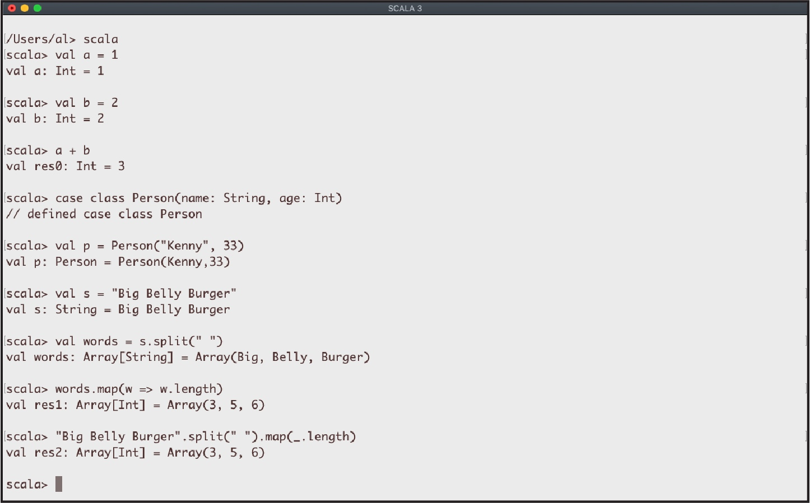

# 命令行任务

我们的Scala 3之旅将从命令行下工作开始。比如，在你按照xxi页“安装Scala”后，你可能会想要从操作系统的命令行中输入 scala 来启动Repl——Scala的 读取/求值/打印/循（或者这里不翻译直接使用Read/Eval/Print/Loop更好？）。或者你可能想要创建一个小小的基于文件的“Hello, world“项目，然后来编译运行它。因为许多人开始使用Scala是从命令行任务开始的，所以我们先从这里开始介绍。

REPL是一个命令行*shell*，它是一个小操场，你可以在这里运行各种小测试来看看Scala和它的一些第三方库是如何工作的。如果你熟悉Java的JShell，Ruby的**irb**，Python的shell或者IPython，或者Haskell的**ghci**，那么Scala的REPL与这些都很相似。如图1-1所示，只要在操作系统命令行输入`scala` 就可以启动REPL，然后再输入Scala表达式然后就会在 shell 中被求值。

当你想测试一些Scala代码时，REPL是一个绝佳的实验环境。没必要创建一个完整的工程——只需要将你的测试代码放到REPL中进行实验，直到你知道它能工作了为止。由于REPL是一个非常重要的工具，它最重要的功能将在本章的前两个例子中演示。



图1-1. macOS 终端窗口中运行Scala3 REPL

虽然REPL非常棒，但它不是你唯一的选项。*Ammonite REPL* 最初是为Scala 2创建的，它比Scala2 REPL有更多的功能，包括：

- 能从GitHub和Maven仓库中导入代码
- 保存和恢复会话的能力
- 美化打印输出
- 多行编辑

在写这本书的时候， Ammonite 仍在被移植到Scala 3， 但许多重要的功能已经可以使用了。关于如何使用这些功能的例子，见例子1.3。

最后，当你需要构建Scala项目时，你通常会使用像sbt这样的构建工具，这将在第17章中演示。但如果你想编译和运行一个小型的Scala应用，比如只有一两个文件，你可以用**scalac** 命令编译你的代码，然后使用**scala** 运行就像在Java中使用**javac**和**java**命令那样。这些过程将在例子1.4中进行演示。之后，例子1.6展示了如何使用**java**或**scala**命令运行你打包成JAR文件的应用程序。

## 1.1 Scala REPL 入门

### 问题

开始使用Scala REPL，使用它的一些基本功能

### 解决方法

如果你使用过Java，Python，Ruby和Haskell等语言的REPL环境，你会觉得Scala REPL很熟悉。要启动REPL，在你的操作系统的命令行中输入**scala**。当REPL启动时，你可能看到一个初始信息，紧接着的是 **scala**>提示符：

```
$ scala
Welcome to Scala 3.0
Type in expressions for evaluation. Or try :help.

scala> _
```

该提示表明你正在使用Scala REPL。在REPL环境中，你可以尝试各种不同的实验和表达式。

```
scala> val x = 1
x: Int = 1

scala> val y = 2
y: Int = 2

scala> x + y res0: Int = 3
scala> val x = List(1, 2, 3)

x: List[Int] = List(1, 2, 3)
scala> x.sum res1: Int = 6
```

正如上述例子所示：

- 在你输入命令后，REPL输出显示你的表达式的结果，包括数据类型信息。
- 如果你没有指定一个变量名，如第三个例子所示，REPL会创建自己的变量，以**res0**开头然后是**res1**以此类推。你可以直接使用这些变量名，就像这些变量是你创建的那样：

```
scala> res1.getClass 
res2: Class[Int] = int
scala> res1 + 2 
res3: Int = 8
```

初学者和有经验的开发者每天都会在REPL中编写代码，以快速了解Scala的功能和他们自己的算法是如何工作的。

#### Tab 补全

有一些简单的技巧可以使REPL的使用更加有效。一个技巧是使用*tab 补全*来查看一个对象上的可用方法。我们可以通过输入1然后一个小数点再然后按Tab键来看看tab 补全是如何工作的。REPL的响应是列出**Int**实例上的几十个可用方法：

```
scala> 1.

!=     	finalize     	round 
##     	floatValue   	self
%      	floor        	shortValue
&      	formatted    	sign
*      	getClass     	signum
many more here ...

```

